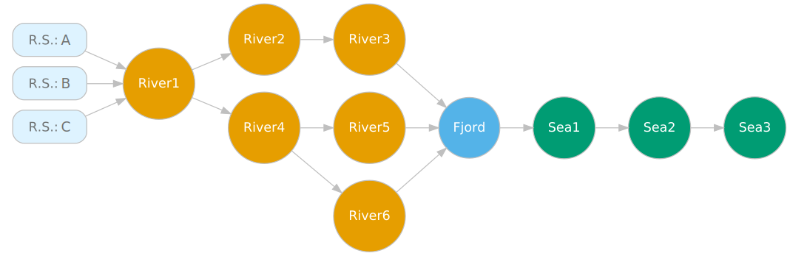
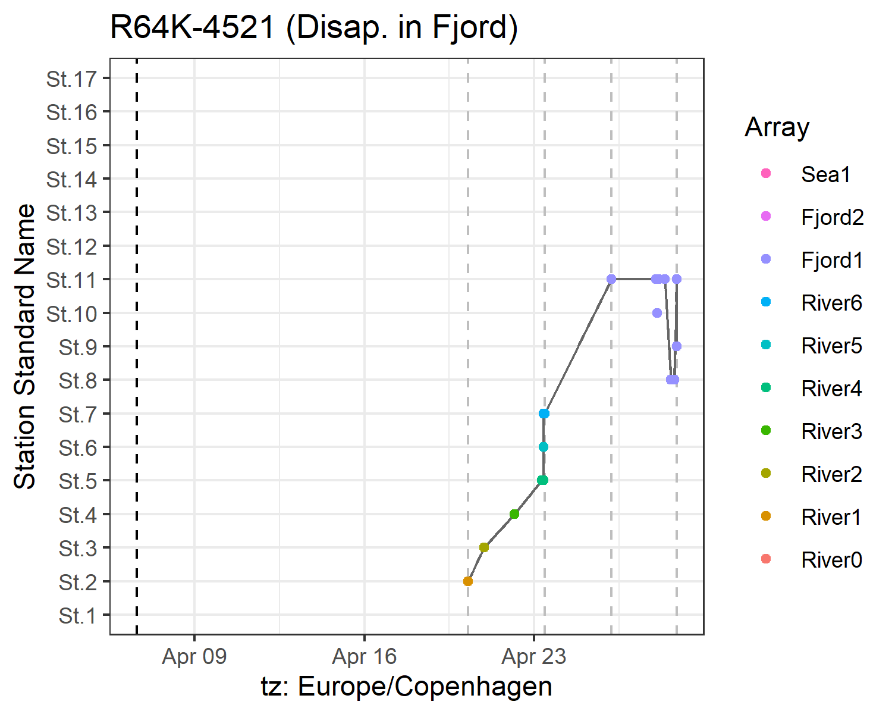
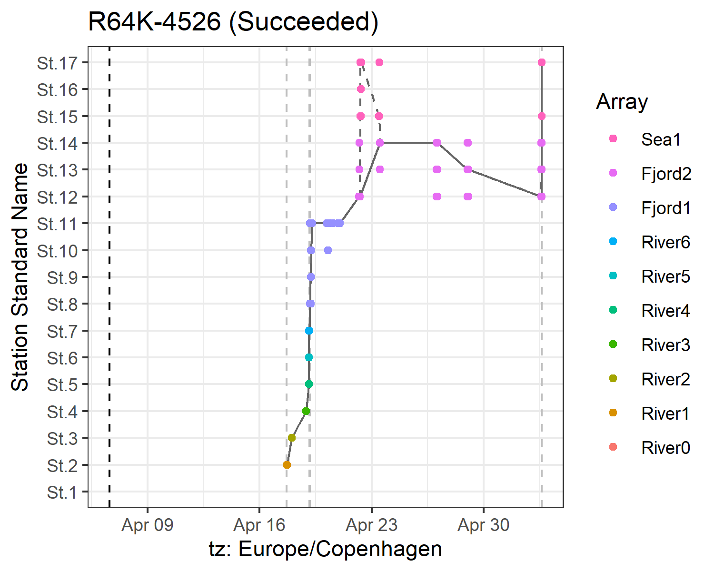
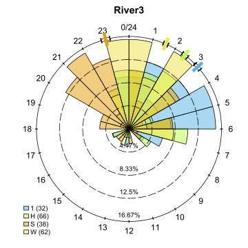
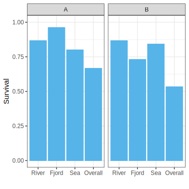
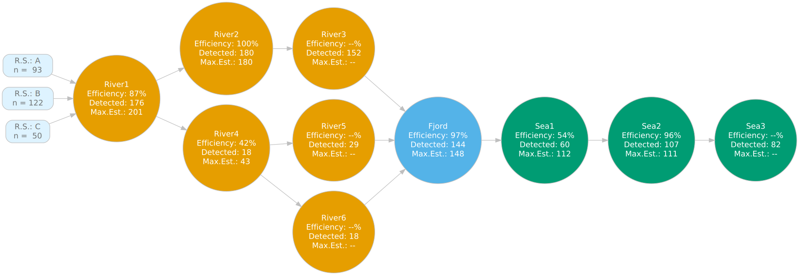
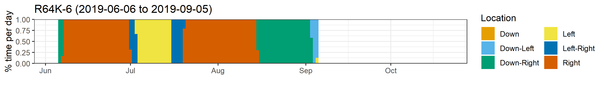
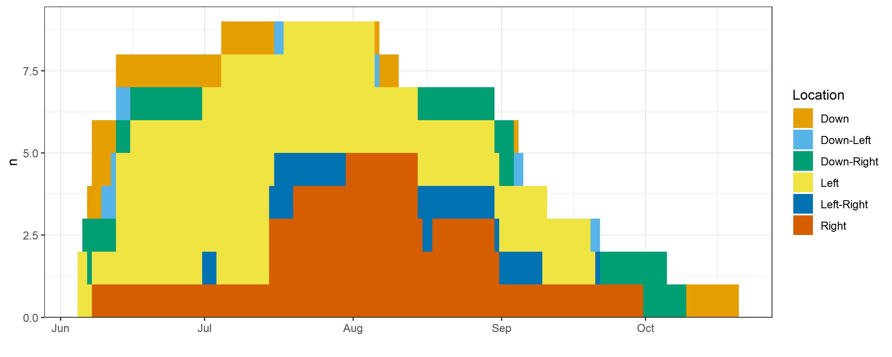

Jump to [**installation instructions**](#installing-actel)

# actel

 of non-interactive code*

Read the [latest news here!](https://github.com/hugomflavio/actel/blob/master/NEWS.md#news)

## Overview

If you are using acoustic telemetry to track animals as they move inside a study area or as they migrate somewhere, actel is the package for you. 
By bringing together the study area configuration and the recorded detections, actel provides a systematic way of analysing animal migration and residency data.

### Main functions:

**1. explore()**

 explore() allows you to quickly get a summary of your data. You can use explore() to get a general feel for the study results, and check if the input files are behaving as expected. It is also a good candidate if you just want to validate your detections for later use in other analyses.
 
**2. migration()**

  The migration() analysis runs the same initial checks as explore(), but on top of it, it analyses the animal behaviour. By selecting the arrays that lead to success, you can define whether or not your animals survived the migration. Additional plots help you find out if some animal/tag has been acting odd. Multiple options allow you to tweak the analysis to fit your study perfectly.
 
**3. residency()**

  The residency() analysis runs the same initial checks as explore(), but, similarly to migration, explores particular points of the animal behaviour. If you want to know where your animals were in each day of the study, how many animals were in each section each day, and other residency-focused variables, this is the analysis you are looking for!

## Unlock actel's full potential

To truly learn how to operate actel, you must read the package vignettes. These have been arranged so that you can
prepare your analysis as you learn; quite soon you will get your first results!

Here are some examples: 

**Movement tables:**

|Array  | Detections|First station |Last station |First time          |Last time           |Time travelling |Time on array |
|:------|----------:|:-------------|:------------|:-------------------|:-------------------|---------------:|-------------:|
|River1 |         14|St.1          |St.2         |2019-05-15 10:30:00 |2019-05-15 13:00:00 |        25:20:14|       2:30:00|
|River2 |          3|St.4          |St.4         |2019-05-15 13:50:00 |2019-05-15 14:40:00 |         0:50:00|       0:50:00|
|River3 |          8|St.5          |St.6         |2019-05-15 16:00:00 |2019-05-15 16:20:00 |         1:20:00|       0:20:00|
|Fjord2 |         21|St.10         |St.11        |2019-05-16 15:10:00 |2019-05-16 18:00:00 |        22:50:00|       2:50:00|
|Sea1   |          1|St.18         |St.18        |2019-05-18 09:45:00 |2019-05-18 09:45:00 |        15:45:00|       0:00:00|

**Detection graphics**

 

**Times of arrival and summary information**

 

**Array efficiency and tag progression**

**Individual residency**

**Global residency**

## Installing actel 

**CRAN version: 1.3.0**

actel is available on CRAN. To install the latest stable version, simply run:

    install.packages("actel")

**Development version**

If you would like to install the [latest updates](https://github.com/hugomflavio/actel/blob/master/NEWS.md#news) (which have not been integrated to CRAN yet), you can run the line below. Note that you need to have the package `remotes` installed!

    remotes::install_github("hugomflavio/actel", build_opts = c("--no-resave-data", "--no-manual"), build_vignettes = TRUE)

**Have a look at the manual:**

After installing, you should read the manual, which can now be found in [actel's website](https://hugomflavio.github.io/actel-website/index.html).

**Note:**

1. If you are getting "pandoc document conversion" errors during the package installation, try installing the [newest version of pandoc](https://pandoc.org/installing.html), restarting R and trying again.

* interactive code (i.e. code that expects user input) cannot be tested automatically using codecov and, as such, was excluded from the codecov scope.

## Works using or relating to actel

**2023** (13)

- Becker, A., Fielder, D. S., Lowry, M. B., & Taylor, M. D. (2023). Suitability of saltmarsh creeks as release locations for stocked Mulloway (Argyrosomus japonicus). Estuarine, Coastal and Shelf Science, 108455. https://doi.org/10.1016/j.ecss.2023.108455

- Davey, J., Clarke, T. M., Niella, Y., Dennis, J. D., & Huveneers, C. (2023). Seasonal variation in space use and residency of the southern eagle ray _Myliobatis tenuicaudatus_ in a temperate ecosystem. Marine Ecology Progress Series, 705, 77–94. https://doi.org/10.3354/meps14232

- Davies, P., Britton, J. R., Castro-Santos, T., Crundwell, C., Dodd, J. R., Nunn, A. D., Velterop, R., & Bolland, J. D. (2023). Tracking anadromous fish over successive freshwater migrations reveals the influence of tagging effect, previous success and abiotic factors on upstream passage over barriers. Canadian Journal of Fisheries and Aquatic Sciences. https://doi.org/10.1139/cjfas-2022-0196

- Dhellemmes, F., Aspillaga, E., Rittweg, T., Alós, J., Möller, P., & Arlinghaus, R. (2023). Body size scaling of space use in coastal pike (_Esox lucius_) in brackish lagoons of the southern Baltic Sea. Fisheries Research, 260, 106560. https://doi.org/10.1016/j.fishres.2022.106560

- Dhellemmes, F., Aspillaga, E., & Monk, C. T. (2023). ATfiltR: A solution for managing and filtering detections from passive acoustic telemetry data. MethodsX, 10, 102222. https://doi.org/10.1016/j.mex.2023.102222

- Flink, H., Tibblin, P., Hall, M., Hellström, G., & Nordahl, O. (2023). Variation among bays in spatiotemporal aggregation of Baltic Sea pike highlights management complexity. Fisheries Research, 259, 106579. https://doi.org/10.1016/j.fishres.2022.106579

- Höhne, L., Freese, M., Pohlmann, J.-D., Diekmann, M., Fladung, E., Huisman, J. B. J., Hanel, R., & Marohn, L. (2023). Overestimating management progress—Modelled vs. Monitored silver eel escapement in a North Sea draining river. ICES Journal of Marine Science, fsad122. https://doi.org/10.1093/icesjms/fsad122

- Huisman, J. B. J., Höhne, L., Hanel, R., Kuipers, H., Schollema, P. P., & Nagelkerke, L. (2023). Factors influencing the downstream passage of European silver eels (_Anguilla anguilla_) through a tidal sluice. Journal of Fish Biology, (in press). https://doi.org/10.1111/jfb.15398

- Kraft, S., Gandra, M., Lennox, R. J., Mourier, J., Winkler, A. C., & Abecasis, D. (2023). Residency and space use estimation methods based on passive acoustic telemetry data. Movement Ecology, 11(1), 12. https://doi.org/10.1186/s40462-022-00364-z

- Kressler, M. M., Dall, S. R. X., & Sherley, R. B. (2023). A framework for studying ecological energy in the contemporary marine environment. ICES Journal of Marine Science, 80(6), 1580–1593. https://doi.org/10.1093/icesjms/fsad082

- Nordli, E., Strøm, J., Bøhn, T., Thorstad, E., Serra-Llinares, R., Nilsen, R., & Bjørn, P. (2023). Behaviour and habitat use of first-time migrant Arctic charr: Novel insights from a subarctic marine area. Marine Ecology Progress Series, 709, 77–90. https://doi.org/10.3354/meps14279

- O’Connor, B. (2023). Linking spatial stream network modeling and telemetry data to investigate thermal habitat use by adult arctic grayling [Master of Science, University of Northern British Columbia]. https://doi.org/10.24124/2023/59378

- van Leeuwen, C. H. A., de Leeuw, J. J., van Keeken, O. A., Volwater, J. J. J., Seljee, F., van Aalderen, R., van Emmerik, W. A. M., & Bakker, E. S. (2023). Multispecies fish tracking across newly created shallow and deep habitats in a forward-restored lake. Movement Ecology, 11(1), 43. https://doi.org/10.1186/s40462-023-00405-1

**2022** (5)

- Edwards, M. L., McCallister, M., Brewster, L. R., Bangley, C. W., Curtis, T. H., Ogburn, M. B., & Ajemian, M. J. (2022). Multi-year assessment of immature bull shark <i>Carcharhinus leucas</i> residency and activity spaces in an expansive estuarine nursery. Marine Ecology Progress Series, 695, 125–138. https://doi.org/10.3354/meps14113

- Hewitt, D. E., Niella, Y., Johnson, D. D., Suthers, I. M., & Taylor, M. D. (2022). Crabs Go With the Flow: Declining Conductivity and Cooler Temperatures Trigger Spawning Migrations for Female Giant Mud Crabs (<i>Scylla serrata</i>) in Subtropical Estuaries. Estuaries and Coasts. https://doi.org/10.1007/s12237-022-01061-1

- Hollins, J., Pettitt-Wade, H., Gallagher, C. P., Lea, E. V., Loseto, L. L., & Hussey, N. E. (2022). Distinct freshwater migratory pathways in Arctic char (<i>Salvelinus alpinus</i>) coincide with separate patterns of marine spatial habitat-use across a large coastal landscape. Canadian Journal of Fisheries and Aquatic Sciences. https://doi.org/10.1139/cjfas-2021-0291

- Thorkildsen, T. B. (2022). Anadromous Arctic charr: Mapping of migration and habitat use in Isfjorden, Svalbard [Master thesis, Norwegian University of Life Sciences, Ås]. https://nmbu.brage.unit.no/nmbu-xmlui/handle/11250/3018496

- Thorstensen, M. J., Vandervelde, C. A., Bugg, W. S., Michaleski, S., Vo, L., Mackey, T. E., Lawrence, M. J., & Jeffries, K. M. (2022). Non-Lethal Sampling Supports Integrative Movement Research in Freshwater Fish. Frontiers in Genetics, 13. https://www.frontiersin.org/articles/10.3389/fgene.2022.795355

**2021** (7)

- Flávio, H., & Baktoft, H. (2021). actel: Standardised analysis of acoustic telemetry data from animals moving through receiver arrays. Methods in Ecology and Evolution, 12(1), 196–203. https://doi.org/10.1111/2041-210X.13503

- Flávio, H., Caballero, P., Jepsen, N., & Aarestrup, K. (2021). Atlantic salmon living on the edge: Smolt behaviour and survival during seaward migration in River Minho. Ecology of Freshwater Fish, 30(1), 61–72. https://doi.org/10.1111/eff.12564

- Niella, Y., Smoothey, A. F., Taylor, M. D., Peddemors, V. M., & Harcourt, R. (2021). Environmental Drivers of Fine-Scale Predator and Prey Spatial Dynamics in Sydney Harbour, Australia, and Adjacent Coastal Waters. Estuaries and Coasts. https://doi.org/10.1007/s12237-021-01020-2

- Nordli, E. (2021). The behaviour of anadromous Arctic charr during their first marine migration [Master thesis, Arctic University of Norway]. https://munin.uit.no/handle/10037/21752

- Winter, E. R. (2021). The movement ecology of common bream _Abramis brama_ in a highly connected wetland using acoustic telemetry. [Doctoral thesis, Bournemouth University]. http://eprints.bournemouth.ac.uk/35141/

- Winter, E. R., Hindes, A. M., Lane, S., & Britton, J. R. (2021a). Movements of common bream _Abramis brama_ in a highly connected, lowland wetland reveal sub-populations with diverse migration strategies. Freshwater Biology, 66(7), 1410–1422. https://doi.org/10.1111/fwb.13726

- Winter, E. R., Hindes, A. M., Lane, S., & Britton, J. R. (2021b). Acoustic telemetry reveals strong spatial preferences and mixing during successive spawning periods in a partially migratory common bream population. Aquatic Sciences, 83(3), 52. https://doi.org/10.1007/s00027-021-00804-9

**2020** (2)

- Flávio, H., Kennedy, R., Ensing, D., Jepsen, N., & Aarestrup, K. (2020). Marine mortality in the river? Atlantic salmon smolts under high predation pressure in the last kilometres of a river monitored for stock assessment. Fisheries Management and Ecology, 27(1), 92–101. https://doi.org/10.1111/fme.12405

- Niella, Y., Flávio, H., Smoothey, A. F., Aarestrup, K., Taylor, M. D., Peddemors, V. M., & Harcourt, R. (2020). Refined Shortest Paths (RSP): Incorporation of topography in space use estimation from node-based telemetry data. Methods in Ecology and Evolution, 11(12), 1733–1742. https://doi.org/10.1111/2041-210X.13484

Is your paper not here? Let me know!
