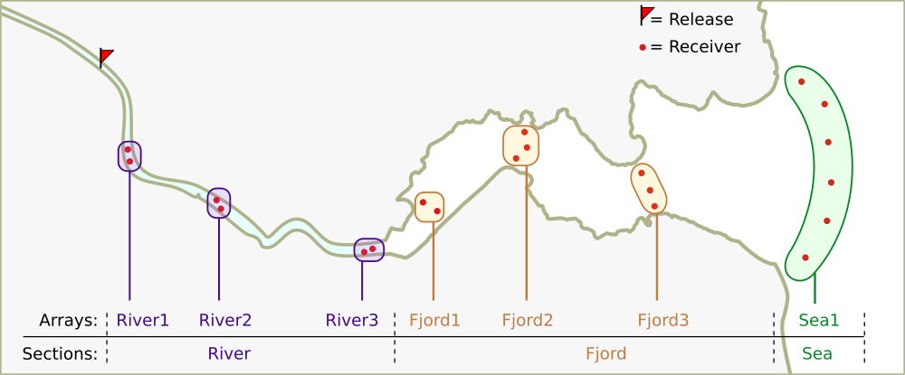
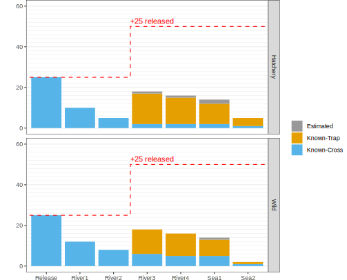

Jump to [**installation instructions**](#installing-actel)

## Actel: Acoustic telemetry data sorting

If you are tracking animals during their migration using acoustic telemetry, actel is the package for you. 
By bringing together the study area configuration and the recorded detections, actel provides a systematic way of analysing fish migration data.

### Main functions:

**1. exampleWorkspace()**

  The exampleWorkspace() function creates a directory containing real data. You can
  then run the analysis on that data to get an overview of the process. When you run
  exampleWorkspace() the code required to analyse the data will be automatically
  provided.
 
**2. createWorkspace()**

  The createWorkspace() function is similar to the one above, but it creates template 
  files instead, which you can use to quickly transform your data to the required formats.
 
**3. actel()**

  The actel() function runs your analysis. This function has many variables and
  although you do not need to work with all of them right away, we recommend
  that you read the actel vignettes before running this function.

## Unlock actel's full potential

To truly learn how to operate actel, you must read the package vignettes. These have been arranged so that you can
prepare your analysis as you learn; quite soon you will get your first results!

Here are some examples: 

**Movement tables:**

|Array  | Detections|First station |Last station |First time          |Last time           |Time travelling |Time on array |
|:------|----------:|:-------------|:------------|:-------------------|:-------------------|:---------------|:-------------|
|River1 |         14|St.1          |St.2         |2019-05-15 10:30:00 |2019-05-15 13:00:00 |NA              |3:30          |
|River2 |          3|St.4          |St.4         |2019-05-15 13:50:00 |2019-05-15 14:40:00 |0:50            |0:50          |
|River3 |          8|St.5          |St.6         |2019-05-15 16:00:00 |2019-05-15 16:20:00 |1:20            |0:20          |
|Fjord2 |         21|St.10         |St.11        |2019-05-16 15:10:00 |2019-05-16 18:00:00 |22:50           |2:50          |
|Sea1   |          1|St.18         |St.18        |2019-05-18 09:45:00 |2019-05-18 09:45:00 |15:45           |0:00          |

**Detection graphics**

 

**Times of arrival**

 

**Summary information**

 

## Installing actel

To install actel, you will need to have the devtools package installed.

    install.packages("devtools")
    library("devtools")
    
Now you can either install actel sourcing remotely or locally.

**a) install directly from the repository:**

    devtools::install_github("hugomflavio/actel", build_opts = c("--no-resave-data", "--no-manual"))

**b) install locally:**

1. Download actel's source files here: [**actel-master.zip**](https://github.com/hugomflavio/actel/archive/master.zip)
1. Unzip the file and move your R session into the newly created folder
1. Run: 

        devtools::install("actel-master", build_vignettes = TRUE)

After installing, you should read the package vignettes, which can be found by running:

    browseVignettes('actel')

**Note:** There have been some reports that the **vignettes are not being installed** through option A. If you installed actel remotely and the vignettes are not showing up, **try using the second installation method**.

