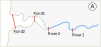
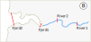
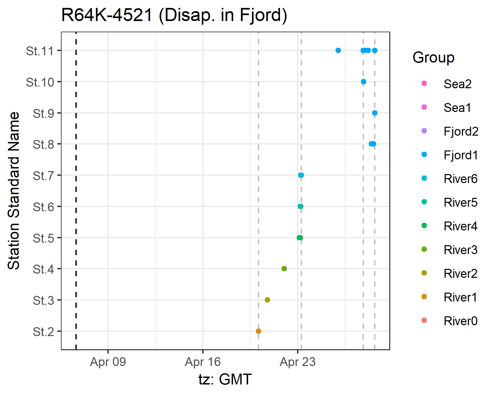
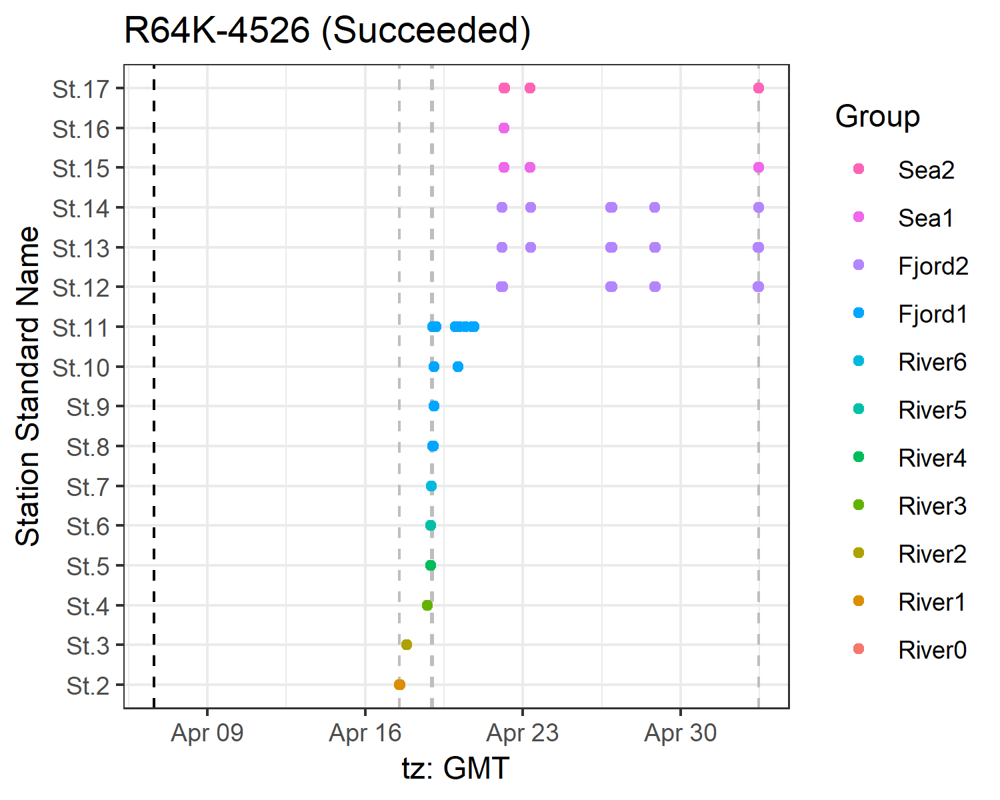

```{r setup, include = FALSE}
knitr::opts_chunk$set(
  collapse = TRUE,
  comment = "#>"
)
```

## Index

1. [Preparing your data](1.0.workspace_requirements.html)
    1. [Structuring the study area](1.1.study_area.html)
    1. [Creating a distances matrix](1.2.distances_matrix.html)
1. [**Running actel**](2.0.running_analysis.html)
1. [What is actel doing?](3.0.the_sorting_process.html)
    1. [Errors and messages](3.1.messages.html)
1. [Inspecting the results](4.inspecting_results.html)
1. [Refining the results](5.refining_results.html)

## Running the analysis

Now that you have [prepared your workspace](1.0.workspace_requirements.html), it is time to start the analysis. The first thing you need to do is provide the required variables to the actel function. 

Although there are many variables available in the main function, *you do not need to start working with all of them right away*. If you want to make a quick check of your data, just set the `path`, `section`, `success.arrays` and `tz.study.area` variables and [you will be ready to start](3.0.the_sorting_process.html)!

#### Simplified actel function (showing defaults):
```r
actel(path = NULL, sections, success.arrays, tz.study.area)
```

#### Full actel function (showing defaults):
```r
actel(path = NULL, sections, success.arrays, minimum.detections = 2, 
    maximum.time = 60, speed.method = c("last to first", "first to first"), 
    if.last.skip.section = TRUE, tz.study.area, start.timestamp = NULL, 
    end.timestamp = NULL, report = TRUE, redraw = TRUE, override = NULL, 
    exclude.tags = NULL, cautious.assignment = TRUE, replicate = NULL)
```

## Function parameters:

### path

The `path` is the way to the folder where you want to run the analysis. If you are already working in the folder where you have your data files, leave path as `NULL` and the analysis will be run in the current directory.

### sections

The study area sections must be set in the order that you expect your fish will cross them. I.e. if you expect your fish to move from the river, to a fjord and ultimately to the sea (and you have hydrophones in all these ecosystems), then `sections = c("River","Fjord","Sea")`. On the other hand, if you expect your fish to migrate upstream, then `sections = c("Sea","Fjord","River")`. To learn more about how to organise your study area in an actel-friendly way, have a look at [this manual page.](1.1.study_area.html)

### success.arrays

If a fish is last detected at an array listed in `success.arrays`, it will be considered as having successfully crossed the study area. In most cases, this will simply be your last array. However, if you are not sure about your array's capacity to detect every passing fish, you can define multiple success arrays (e.g. `success.arrays = c("Sea1","Sea2")` ).

### minimum.detections

This variable controls how many times a fish must be registered to be considered valid, if there is only one movement event. Movement events are [explained in greater detail here](3.0.the_sorting_process.html#from-detections-to-movements). Lets have a look at an example:

Fish A only has one movement event at *River1*, with one detection.
    
  * If `minimum.detections = 1`, this movement is considered **valid**, and the fish is considered to have passed through *River1* and then disappeared.

  * If `minimum.detections = 2`, this movement is considered **invalid** (i.e. could be the result of error detections), and the fish is considered to have been lost after release.

If a Fish has more than one movement event, then the `minimum.detections` variable no longer plays a role. For example, if Fish B has two movement events at *River1*, both with one detection (i.e. two detections in total), these movements are considered valid even if `minimum.detections = 3`. This is because it is unlikely for two errors coding for the same signal to occur at two separate points in time and/or space.

### maximum.time

If a fish is detected multiple times at one array without being detected on other arrays, these detections are grouped into a single event, assuming that the time difference between two consecutive detections does not exceed `maximum.time` (which is set in **minutes**). Should the time between detections exceed `maximum.time`, a new movement event will be created, on the same hydrophone array.

In the example below, you can see how the same detections can be interpreted as a different number of movement events depending on whether we set `maximum.time` to **a)** 120 minutes, **b)** 60 minutes or **c)** 30 minutes.


#### Movements table for example a:

|Array  | Detections|First station |Last station |First time          |Last time           |Time travelling |Time on array |
|:------|----------:|:-------------|:------------|:-------------------|:-------------------|:---------------|:-------------|
|Array1 |         14|St.1          |St.1         |2019-05-15 12:00:00 |2019-05-15 19:45:00 |NA              |7:45          |

#### Movements table for example b:

|Array  | Detections|First station |Last station |First time          |Last time           |Time travelling |Time on array |
|:------|----------:|:-------------|:------------|:-------------------|:-------------------|:---------------|:-------------|
|Array1 |          7|St.1          |St.1         |2019-05-15 12:00:00 |2019-05-15 14:40:00 |NA              |2:40          |
|Array1 |          6|St.1          |St.1         |2019-05-15 16:00:00 |2019-05-15 18:00:00 |1:20            |2:00          |
|Array1 |          1|St.1          |St.1         |2019-05-15 19:45:00 |2019-05-15 19:45:00 |1:45            |0:00          |

#### Movements table for example c:

|Array  | Detections|First station |Last station |First time          |Last time           |Time travelling |Time on array |
|:------|----------:|:-------------|:------------|:-------------------|:-------------------|:---------------|:-------------|
|Array1 |          4|St.1          |St.1         |2019-05-15 12:00:00 |2019-05-15 13:00:00 |NA              |1:00          |
|Array1 |          3|St.1          |St.1         |2019-05-15 13:50:00 |2019-05-15 14:40:00 |0:50            |0:50          |
|Array1 |          2|St.1          |St.1         |2019-05-15 16:00:00 |2019-05-15 16:20:00 |1:20            |0:20          |
|Array1 |          4|St.1          |St.1         |2019-05-15 17:10:00 |2019-05-15 18:00:00 |0:50            |0:50          |
|Array1 |          1|St.1          |St.1         |2019-05-15 19:45:00 |2019-05-15 19:45:00 |1:45            |0:00          |

### speed.method

<!-- <span style="color:red">**NOTE:** Speed calculations are currently under reconstruction. Changing the speed method will have **no** effect in the results right now.</span> -->

When calculating movement speeds from one array to the next, it is important to know if actel should count the time from the **last** detection on one array until the **first** detection on the next, or if you want actel to count the time from the **first** detection on one array to the **first** detection on the next. This is what `speed.method` is doing. You can choose one of `"last to first"` or `"first to first"`. The example below ilustrates the difference between both:


### if.last.skip.section

This option is best explained with examples. Let us assume we have a study area with four arrays: River1, River2, Fjord1 and Fjord2. Now we have a fish that was last detected at River2. Should this fish be considered to have disappeared in the river or in the fjord? It comes down to how your stations are deployed in the field, and this is what `if.last.skip.section` is controlling for. Lets have a look at the two maps below.

 

On study area **A**, it seems reasonable that a fish last detected at River2 has likely died in the fjord, before reaching Fjord1. In this case, `if.last.skip.section = TRUE`.

However, on study area **B**, if a fish was last detected at River2, it most likely died somewhere in the river. In this case, `if.last.skip.section = FALSE`.

### tz.study.area

Hydrophones usually work in Coordinated Universal Time (UTC). Although this is nice to integrate data from multiple hydrophones, depending on where you are working, it may mean that the hydrophones' time is actually displaced from the daytime in your study area. To correct for this, you must include your time zone in this field. For example, when we have study areas in Denmark, we must use `tz.study.area = "Europe/Copenhagen"`.

Time zones can be complicated business, so to help you out, you can search <a href="https://en.wikipedia.org/wiki/List_of_tz_database_time_zones" target="_blank">this wiki page</a> for which time zone code you should use.

Note:
  : This time zone **must** match the time zone of the release times listed in the [biometrics file](1.0.workspace_requirements.html#biometrics-file).


### start.timestamp and end.timestamp

Sometimes your hydrophones contain much more detection data than what you are interested in, which can increase the time it takes to process all the detections. By including a `start.timestamp` and/or an `end.timestamp`, you can trim the detection data to those target date and times.

This is particularly relevant if, for example, you used some of your tags as testers before the study started, or if you used one of ths study's hydrophones to activate and test the tags. A fish being detected before being released is a major issue, and actel will complain about that:

```
Error: Fish 1234 was detected before being released!
Would you like to see the data from fish 1234?(Y/n) 

[...]

Would you like to stop the process?(Y/n)
```

Although you can choose to continue the analysis, the time from release to the first section will not be calculated to that fish, so we highly recommend that you stop and correct the issue.

Note:
  : The timestamps **must** be written in **yyyy-mm-dd hh:mm:ss** format, in the same time zone as your study area.

### report

The `report` option activates a series of print functions that draw tables and figures for later integration in a html report. When you activate this option, a new *Report* subdirectory is created, where all the relevant files are stored. Before finishing, actel assembles the html report and stores it in your working directory. If you already have a report in your working directory, actel will create a new file with a different name.

You can also inspect each graphic individually in the *Report* subdirectory.

Here are some examples:

 

 

Note:
  : Even if something fails during the report printing, your results will still be saved the *actel_results.RData* file in your working directory!

### redraw

The `redraw` variable prevents/allows actel from overwriting figure files that are already present in the *Report* folder. If you find yourself in the need to rerun the same analysis, or would like to reprint only a specific graphic, you can delete the respective file, and rerun the analysis with `redraw = FALSE` to save yourself some time. This will make sure **only** the missing files are drawn.

### override

Once you finish your analysis, you should go through the generated html report (or the files present in the *Results* folder), and check for any strange behaviour. We will discuss this in more detail [later on](4.inspecting_results.html), but for now the important message is that, if you would like to manually change the results for any set of tags, you can list those tags in `override` to trigger full manual mode (e.g. `override = c("R64K-1234","R64K-1405")`).

When you list tags in `override`, actel will recognise them and enter full manual mode when it is their turn to be analysed. You will know this is happening when you see the following message:

```
M: Override has been triggered for fish R64K-1234. Entering full manual mode.
```

You can find more information on [how to operate full manual mode here](5.refining_results.html).

### exclude.tags

It is possible for a stray tag with the same signal as one of your tags enter the study area. Although this is unexpected, it would mean you could end up with two tags that differ only in code spaces. As actel works based on the tag signals alone, it does not know which tag is yours, and which is a stray, so you must intervene. If this happens, the following error is issued:

```
E: One or more signals match more than one tag in the detection detections! Showing relevant signals/tags.
   Signal 1234 was found on tags R64K-1234, R65K-1234.
Error: Fatal exception found. Stopping analysis.
```

When presented with this, find out which of the tag is yours, and **type in the stray tag** in the excluded tags before restarting the analysis. For example, if your tag is R46K-1234, then run the analysis with `exclude.tags="R65K-1234"`.

### cautious.assignment

Isolated detections lead to movement events with only one detection. These movement events are less robust than events with multiple detections, and can be caused by flawed detections. Actel tries to avoid assigning movement events with one detection as the first and/or last events for a given section, to ensure that the results are as robust as possible (hence why `cautious.assignment` defaults to `TRUE`).

If you set `cautious.assignment` to `FALSE`, actel will consider all movement events as equally reliable for assignment. This may be helpful if you believe your arrays have a short range or if your fish are swimming very fast, and thus low detection numbers are expected.

Now that you know how to start the process, you can learn more about [what is going on](3.0.the_sorting_process.html).

### replicate

One of the main drawbacks of array efficiency calculations is that it can be tricky to estimate efficiency for your very last array. However, if your last array is composed of two lines of hydrophones, one line can be used as a replicate of the other, which in turn allows for the estimation of the last array efficiency. If this is your case, then you can write in the *Standard.Name* of the stations composing your replicate in the `replicate` argument.

Note:
  : Array replication is only applicable for the **very last** array reported in the spatial.csv file.
  : Array replication should only be performed if the replicate stations cover the same extent of the migration route section as the original array, and only if the two lines of receivers are close to each other (i.e. one can assume 0% mortality between them). Have a look at the figures below for some examples.

 

 

Also note that you **must** use the stations standard names (i.e. St.10, St.12) when referring to them in actel. If you are not sure what your spatial standard name is, and the column *Standard.Name* does not yet exist in your spatial.csv file, you can run `emptyMatrix()` and that column will be generated for you in the spatial.csv file.

[Back to top.](#)