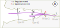
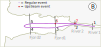

```{r setup, include = FALSE}
knitr::opts_chunk$set(
  collapse = TRUE,
  comment = "#>"
)
```

## Index

1. [Preparing your data](1.0.workspace_requirements.html)
    1. [Structuring the study area](1.1.study_area.html)
    1. [Creating a distances matrix](1.2.distances_matrix.html)
1. [Running actel](2.0.running_analysis.html)
1. [**What is actel doing?**](3.0.the_sorting_process.html)
    1. [Errors and messages](3.1.messages.html)
1. [Inspecting the results](4.inspecting_results.html)
1. [Refining the results](5.refining_results.html)

## Under the hood

You have [prepared your code](2.0.running_analysis.html) and started the analysis. Now you will learn more about what actel is doing.

Note:
  : To keep the this page shorter, we have replaced the big movement tables with "[...]".

The first thing actel does is import your data. This also includes all of your detection files, which can take a bit of time. Then, actel performs some checks to make sure everything is all right. If anything is out of the ordinary, actel will let you know. If need help with any messages, warnings or errors, you can find more about them in our [list of errors and messages](3.1.messages.html).

## From detections to movements

Once everything is in place, actel will group the detections for each fish in multiple movement events. This process is entirely automatic, and the outcome depends on two things:

Arrays
  : When a fish moves from one receiver array to another, a new movement event is created. These arrays are defined by you in the [spatial file](1.0.workspace_requirements.html#spatial-file), so it is worth it to spend some time thinking about how you want to arrange your receivers.

`maximum.time`
  : This parameter controls the creation of multiple events for consecutive detections on the same receiver array. You can [find more information on this parameter here](2.0.running_analysis.html#maximum.time)

## Timetable

Once the movement events have been defined, they will be used to fill in the timetable, which is the most important step. For each fish, we will find out the very first and very last movement event for each of the study area's [sections](2.0.running_analysis.html#sections). This allows us to determine when the fish entered and left the study area's sections, and ultimately determine the fish's fate.

This process is semi-automatic: If the fish behaves as expected (i.e. linear migration), actel can easily find what it needs, but if there are some odd movement events, actel will ask for help to ensure everything is making sense.

### Odd behaviour

Actel expects your fish to move linearly from the release site to the last array on your spatial file (hence why the array order is very important). If this happens, the task of obtaining the first and last times on each section is very simple. However, sometimes fish like to play funny games in your study area, and things can get a bit trickier:

### Backwards movements

Tagged fish can move backwards either because they are reluctant of the new environments or because something ate them and is now moving randomly. The very first evidence of this is that the arrays to which each movement event belongs will no longer be arranged as expected. 

If this happens, but then the fish continues its journey, then the last movement events on each section will still be ordered as expected. Otherwise, if the fish moves backwards and then never returns, then the last movement events of each section will also be in an unexpected order. 

Let's have a look at two examples:

 

#### A) Movement events unordered, but last events ordered

In example **A**, events 1, 2, 3 and 4 are all within expected, but then the fish moves upstream on movement 5. However, the fish then moves back in the expected direction and eventually leaves the study area. In this case, the last event in the Fjord will be after the last event in the River.

Since the upstream movements imply going to an upstream section, this has direct impact on the timetable assignment. As such, you will receive a warning:

````
W: Inter-section backwards movements were detected for Fish R64K-4456.
Would you like to see the movement table for fish R64K-4456 ?(y/N)
````

By default, actel will consider the very last event of each section as the point when the fish leave that section. For this example, that means that the fish would be considered to leave the river (for the last time) on event **5**, enter the fjord (for the last time) in event **6** and leave the fjord in event **7**.

#### B) Both Movement events and last events are unordered

In example **B**, events 1, 2, 3, 4 and 5 are all within expected, but then the fish moves upstream both on event 6 and event 7. The fish then disappears. This means that the last event in the Fjord is actually **before** the last event in the River. 

This has both an impact on the assignment of times and on the assignment of the fish's fate. Unlike above, where you could choose to see the movement events, here they will be opened for you, as this situation will require your intervention.

````
W: Inter-section backwards movements were detected for Fish R64K-4526 and the last events are not ordered!
   Opening movements list for inspection.
````

If actel were to keep the default rules (i.e. the fish left the river on event **7**, and left the fjord on event **6**), then it would be impossible to find a suitable first Fjord event. There are two options you can follow here:

1. Discard the Fjord detections (i.e. events 3, 4, 5 and 6)

2. Assume the fish was predated between event 4 and 5, and discard events 6 and 7.

There is no universal answer to this, you must analyse your scenario and decide the best course of action


#### Correcting the last events

Whether because you answered 'y' on example **A**, or because you were faced with a situation similar to example **B**, actel will show you the following:

````
[...]
Current last events: 6, 20, 33 (River, Fjord, Sea).

Would you like to edit the last valid events?(y/N) 
````

The "Current last events" are pre-selected by actel for each section. If you want to edit any of these, you just have to reply "y" to the current question, select which last event you want to edit (1, 2 or 3 in this case) and the new movement event that should be considered the last event:

````
Would you like to edit the last valid events?(y/N) y
Which last valid event would you like to edit? (1-3) 2
New last valid event for Fjord: 21
Continue editing last valid events?(y/N)
````

If you make a mistake, don't worry; actel will not let you select an event that is not from the current section (e.g. Fjord), nor an event that is previous to the currently defined last event for the previous section (e.g. if the last river event is event 6, you can not select event 5 as the fjord last event).

After you select the new event, you will be asked if you want to edit more last events. This also means that you can correct any changes you made, should you make a mistake.

Note:
  : Once you inspect the movement events, if you decide that all the events for a given section are invalid, you can select that section and, when asked which would be the "New last valid event", simply leave the field empty, and a new question will show up:

````
Would you like to edit the last valid events?(y/N) y
Which last valid event would you like to edit? (1-3) 2
New last valid event for Fjord:
W: The inserted value is not numeric. Continuing will erase all Fjord related timestamps. Proceed?(y/N) 
````

### Events with one detection

By default, actel tries to avoid assigning movement events with one detection as the first and/or last events for a given section. This is because these isolated events are more likely to be miss-detections than events with more than one detection. However, if it happens that all the movement events for a given section have only one detection, actel will ask you to decide which events should be used.

Since actel starts by selecting the last movement events for all sections and only then the first events, you will be asked to assign a last event and *only after* to determine the first event:

````
W: No Sea detection events with more than one detection were found for fish R64K-4575. Opening movements list for inspection.

[...]

Which event should be considered the LAST Sea detection event? 5
Which event should be considered the FIRST Sea detection event? 
````
Note:
  : Like above, if you believe that the events for that section are not valid, you can tell actel to discard those events. When prompted for the last or first movement event of a section, just press enter without any input.

If you believe that the cautious assignment rule is not suitable for your study area (i.e. your fish move very fast or your receiver range is limited), you can [disable `cautious.assignment` when you run the analysis](2.0.running_analysis.html#cautious.assignment).

### Leaving comments for later

If a fish is causing doubts, you can attach a comment to it at any time. Just reply "comment" to a question and the comment dialogue will be triggered:

````
Continue editing last valid events?(y/N) comment
New comment on fish R64K-4456: Was this fish eaten?
M: Comment successfully stored, returning to the previous interaction.
Continue editing last valid events?(y/N) 
````

You can then find all your comments on the PDF report and on the final data frame.

## Combining the time data with the biometrics

The hardest part is done. Now, actel will automatically combine the time information with the information you included in the biometrics file. This new dataframe is called *status.df*, and will be available to you in the function output. It is also here that the [`success.arrays`](2.0.running_analysis.html#success.arrays) come in. If your fish was last detected on an one of those arrays, it will be assigned as "Succeeded".

This is an automatic process, and there is only one thing that can trigger a warning: a fish being detected before being released. If this happens, the following message will show up:

````
Error: Fish R64K-1865 was detected before being released!
  Release time: 2018-04-26 12:00:00
  First valid detection: 2018-04-17 08:33:04 (River).
  Movement table for fish R64K-1865
  [...]

You may either:
  a) Stop the analysis and check your data
  b) Continue anyway (time and speed from release to first valid detection wont be calculated).

Decision:(a/b)
````

It is then up to you to decide which path to take. In the example above, for example, the error could be due to a mistake when typing the data (i.e. the fish may have been released on the 16th and not the 26th). You can always continue running the analysis to verify if this problem arises with other fish, so you can identify what is going on.

Note:
  : This comparison is based on the movement events selected as first and last events for each section. If you have `cautious.assignment` disabled, an isolated false detection could be causing this error to show up.

If you conclude that the problem is being caused due to bad assignment of the first and last events for each section, you can include the tag number in the [`override.tags` variable](2.0.running_analysis.html#override) and take [full control over it](5.refining_results.html).

## Inspecting the results

Finally, actel will compile some summary tables, prepare the report, and finish up. It is time to [have a look at the results!](4.inspecting_results.html)

[Back to top.](#)