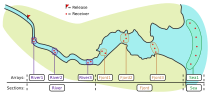
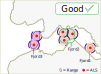
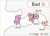
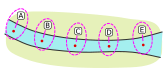
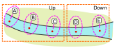
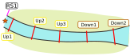
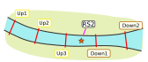
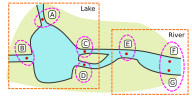
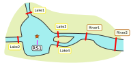

```{r setup, include = FALSE}
knitr::opts_chunk$set(
  collapse = TRUE,
  comment = "#>"
)
```

## Index

1. [Preparing your data](a-0_workspace_requirements.html)
    1. [__Structuring the study area__](a-1_study_area.html)
    1. [Creating a distances matrix](a-2_distances_matrix.html)
    1. [The preload() function](a-3_preload.html)
1. [explore()](b-0_explore.html)
    1. [Processes behind explore()](b-1_explore_processes.html)
    1. [Inspecting the explore() results](b-2_explore_results.html)
1. [migration()](c-0_migration.html)
    1. [Processes behind migration()](c-1_migration_processes.html)
    1. [Inspecting the migration() results](c-2_migration_results.html)
    1. [One-way efficiency estimations](c-3_migration_efficiency.html)
1. [residency()](d-0_residency.html)
    1. [Processes behind residency()](d-1_residency_processes.html)
    1. [Inspecting the residency() results](d-2_residency_results.html)
    1. [Multi-way efficiency estimations](d-3_residency_efficiency.html)
1. [Manual mode](e-0_manual_mode.html)
1. [Beyond the three main analyses](f-0_post_functions.html)

## From the field to the computer

To be able to process your data, actel must understand how your study area works. To do this, actel relies on two things: the study area sections and the receiver arrays. There are three levels of organization in an actel study area: stations, arrays and sections,. Sections are composed by one or more arrays, arrays are composed by one ore more stations, and each station can have one or more receivers deployed in it.

Here is a visual example of a study area with an overlay of the respective arrays and sections:



### Stations

Stations are geographical locations where one or more receivers have been deployed over the course of your study. The stations pinpoint the deployment locations on the map, and allow actel to make the link between receiver detections and their respective arrays. The stations must have unique names, so that the receiver deployments can be allocated to a specific station, and are assigned to their respective arrays and sections using the _spatial.csv_ file. 

You can find some examples below.


#### Release sites

Release sites are a special form of station. Used to pinpoint the release locations of the tagged fish, release sites do not have receivers associated to them. Additionally, instead of being allocated to an array, they indicate which array is expected to be the first to detect the released fish. If you are not sure which array is expected to detect your fish first (i.e. upon release, fish can move to multiple arrays), you can tell actel to expect a first detection at multiple arrays. This has important consequences for array efficiency estimation, so it is important to get this right. Some examples are provided further down.


### Arrays

Arrays are the functional movement unit for actel. They determine groups of stations that, together, represent a point of change in the fish position. In the study area above, there are seven arrays, which are grouped into three sections. Arrays can be named freely, and must be connected to their respective sections using the _spatial.csv_ file.  


#### Avoid overlapping arrays

When a fish moves from one array to another, a new movement event is created (you will learn more about movement events later on). This means that, if you have two stations close to each other, but listed in two different arrays, you can end up with many 'false' movement events (i.e. the fish is just standing still within range of both arrays). Here is an example:

```{r, echo=FALSE, results='asis'}
load("badmovements.Rdata")
knitr::kable(badmovements[20:25,1:7])
```

Stations 15 and 17 are very close to each other, but were placed in different arrays. That in turn led to the creation of numerous movement events with only one detection, with nearly no time travelling between them. This fish ended up having 58 movement events, during most of which it was most likely just standing still.

As a rule of thumb, if two stations' ranges are likely to overlap, you should consider assigning them to the same array:

 


### Sections 

The sections divide your study area in big blocks, for which you would like specific metrics to be calculated (e.g. residency time, survival, etc.). In the example above, there are three sections: River, Fjord and Sea. The sections must be filled in in the 'Section' column of the _spatial.csv_ file.

When running a `migration()` analysis, the order of the sections is relevant and represents the order in which you expect your fish will move. By default, actel will order the sections by the order in which they appear in the spatial.csv file. However, you can force a specific order using the `section.order` argument. For example, if you expect your fish to move from the river to a fjord and ultimately to the sea (and you have receiver arrays in all these sections), then `section.order = c("River", "Fjord", "Sea")`. In the other hand, if you expect your fish to migrate upstream, then `section.order = c("Sea", "Fjord", "River")`.

For the residency analysis, the order of the sections is not relevant, except for plotting and column order purposes. Like above, actel can sort out the order by itself, or you can specify a specific order using the `section.order` argument.

The `explore()` analysis does not take sections into consideration.


### Rivers with multiple parallel channels

If your study area includes multiple pathways that the fish may take, you must tell actel how to connect the arrays. By default, arrays are sorted in a linear order according to the spatial.csv file. To instruct actel to act otherwise, you must create a '**spatial.txt**' file. The spatial.txt file is very simple; all you need to do is connect your arrays in pairs. [You can learn more about spatial.txt files here](a-0_workspace_requirements.html#optional-spatial.txt-file)

Now you know how to organise your study area in a way that actel will understand!

**<a href="javascript:history.back()">Return to previous page</a>**

## Examples

### Single channel:

Let's imagine the following study area, where the red dots represent receiver stations. The first thing you will want to do is give individual names to your stations:

<center>

</center>

Then, you need to decide how these stations should be organized into arrays. In this case, let's say each station is its own array:

<center>

</center>

Then, you need to decide how many sections there are in your study area. In this case, one section (e.g. "River") would probably be the best fit, but let's say we have two sections, for the sake of the exercise:

<center>

</center>

Now that you know your stations, arrays, and sections, you can start filling up the spatial.csv file. Because each array is composed by a single station, you can simply use the station names as array names (avoid using spaces or special characters in array names). Station 'A' will belong to the array 'A', which belongs to section 'Up'; station 'D' belongs to the array 'D' and section 'Down', etc:

```{r, echo=FALSE, results='asis'}
  spatial <- data.frame(Station.name = c("A", "B", "C", "D", "E"),
    Array = c("A", "B", "C", "D", "E"),
    Section = c("Up", "Up", "Down", "Down", "Down"),
    Type = c("Hydrophone","Hydrophone","Hydrophone","Hydrophone","Hydrophone")
    )
knitr::kable(spatial)
```

Now onwards to the release sites. If you only have one release site at the top of the study area, i.e.:

<center>

</center>

Then you are sure that the fish are expected to be first detected at array A:


```{r, echo=FALSE, results='asis'}
  spatial <- data.frame(Station.name = "RS1",
    Array = "A",
    Section = "",
    Type = "Release"
    )
knitr::kable(spatial)
```

However, you can also have fish released somewhere in the middle of the study area, i.e.:

<center>

</center>

In this case, if you know that your fish are expected to move in a specific direction (i.e. a migration scenario), then we could say that there is only one expected first array (array D, if the fish is migrating left to right):

```{r, echo=FALSE, results='asis'}
  spatial <- data.frame(Station.name = "RS2",
    Array = "D",
    Section = "",
    Type = "Release"
    )
knitr::kable(spatial)
```

However, if you do not know which direction the fish will take (i.e. a residency scenario), then the fish is just as likely to be first detected at array D as it is to be detected at array C. To account for this, you must include both arrays in the spatial.csv file, separating them with a "\|".

```{r, echo=FALSE, results='asis'}
  spatial <- data.frame(Station.name = "RS2",
    Array = "C|D",
    Section = "",
    Type = "Release"
    )
knitr::kable(spatial)
```

You can now combine the stations and the release sites to obtain your spatial.csv file:

```{r, echo=FALSE, results='asis'}
  spatial <- data.frame(Station.name = c("A", "B", "C", "D", "E", "RS1", "RS2"),
    Array = c("A", "B", "C", "D", "E", "A", "C|D"),
    Section = c("Up", "Up", "Up", "Down", "Down", "", ""),
    Type = c("Hydrophone", "Hydrophone", "Hydrophone", "Hydrophone", "Hydrophone", "Release", "Release")
    )
knitr::kable(spatial)
```

### Complex study area:

Let's now imagine a more complex study area, like the one below:

<center>

</center>

Like before, you need to name your stations, group them into arrays, and define your study area sections:


<center>

</center>

We can then start filling in the spatial.csv file:

```{r, echo=FALSE, results='asis'}
  spatial <- data.frame(Station.name = c("A", "B", "C", "D", "E", "F", "G"),
    Array = c("North", "West", "East1", "East2","R1", "R2", "R2"),
    Section = c("Lake", "Lake", "Lake", "Lake", "River", "River", "River"),
    Type = c("Hydrophone", "Hydrophone", "Hydrophone", "Hydrophone", "Hydrophone", "Hydrophone", "Hydrophone")
    )
knitr::kable(spatial)
```

Now let's assume the fish are released inside the lake:

<center>

</center>

In this case, regardless of the analysis you are running (migration or residency), there is uncertainty in the first expected array. If you expect that the fish will be migrating from the Lake to the River, you should state that the expected first arrays are either East1 or East2. If you are running a residency analysis, then it may make more sense to consider all Lake arrays as potential first arrays.

So, if you know your fish are moving to the river:

```{r, echo=FALSE, results='asis'}
  spatial <- data.frame(Station.name = "RS1",
    Array = "East1|East2",
    Section = "",
    Type = "Release"
    )
knitr::kable(spatial)
```

If you don't know where the fish will go to:

```{r, echo=FALSE, results='asis'}
  spatial <- data.frame(Station.name= "RS1",
    Array = "North|West|East1|East2",
    Section = "",
    Type = "Release"
    )
knitr::kable(spatial)
```


Like before, you can now compile the full spatial.csv file:


```{r, echo=FALSE, results='asis'}
  spatial <- data.frame(Station.name = c("A", "B", "C", "D", "E", "F", "G", "RS1"),
    Array = c("North", "West", "East1", "East2","R1", "R2", "R2", "Lake1|Lake2|Lake3|Lake4"),
    Section = c("Lake", "Lake", "Lake", "Lake", "River", "River", "River", ""),
    Type = c("Hydrophone","Hydrophone","Hydrophone","Hydrophone","Hydrophone","Hydrophone","Hydrophone","Release")
    )
knitr::kable(spatial)
```

Since this study area is not linear, you would be required to write a spatial.txt file to tell actel how to link the arrays. [You can learn more about spatial.txt files here](a-0_workspace_requirements.html#optional-spatial.txt-file).

[Back to top.](#)