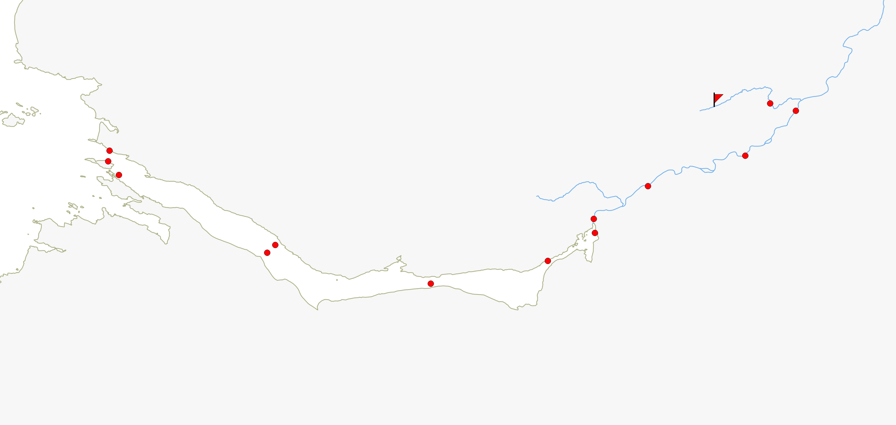
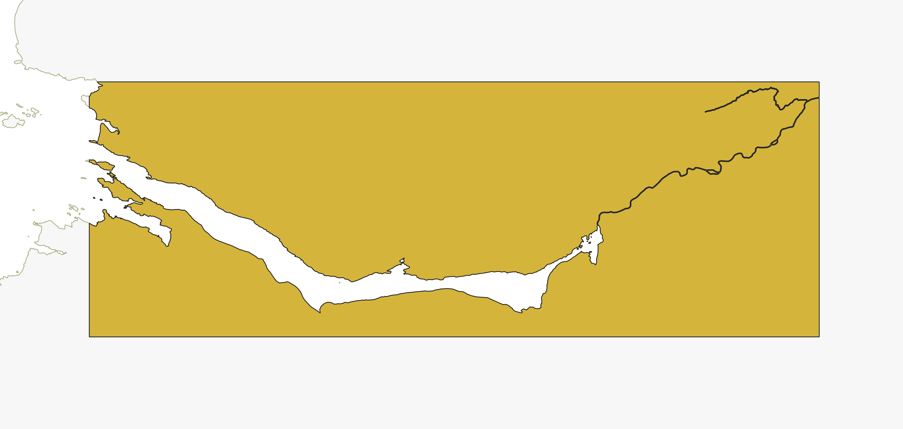

```{r setup, include = FALSE}
knitr::opts_chunk$set(
  collapse = TRUE,
  comment = "#>"
)
```

## Index

1. [Preparing your data](a-0_workspace_requirements.html)
    1. [Structuring the study area](a-1_study_area.html)
    1. [__Creating a distances matrix__](a-2_distances_matrix.html)
1. [explore()](b-0_explore.html)
    1. [Processes behind explore()](b-1_explore_processes.html)
    1. [Inspecting the explore() results](b-2_explore_results.html)
1. [migration()](c-0_migration.html)
    1. [Processes behind migration()](c-1_migration_processes.html)
    1. [Inspecting the migration() results](c-2_migration_results.html)
    1. [One-way efficiency estimations](c-3_migration_efficiency.html)
1. [residency()](d-0_residency.html)
    1. [Processes behind residency()](d-1_residency_processes.html)
    1. [Inspecting the residency() results](d-2_residency_results.html)
    1. [Multi-way efficiency estimations](d-3_residency_efficiency.html)
1. [Manual mode](e-0_manual_mode.html)
1. [Beyond the three main analyses](f-0_post_functions.html)
1. [Errors and messages](g-0_messages.html)

## What is the distances matrix?

A distances matrix is a table that contains information on  the distance (in metres) between every pair of spatial elements in your study area (i.e. your receiver stations and your release sites). It looks like the table below:

|        | St.1| St.2| St.3| St.4|  St.5|  St.6| Release|
|:-------|----:|----:|----:|----:|-----:|-----:|-------:|
|St.1    |    0| 1366| 3417| 6912|  8863|  9272|    2229|
|St.2    | 1366|    0| 2051| 5545|  7497|  7906|    3569|
|St.3    | 3417| 2051|    0| 3528|  5479|  5888|    5621|
|St.4    | 6912| 5545| 3528|    0|  1963|  2372|    9115|
|St.5    | 8863| 7497| 5479| 1963|     0|   408|   11067|
|St.6    | 9272| 7906| 5888| 2372|   408|     0|   11476|
|Release | 2229| 3569| 5621| 9115| 11067| 11476|       0|

Note:
  : The matrix is symmetric (i.e. the entries of the matrix are symmetric with respect to the main diagonal).
  : The diagonal line is composed of 0's as it represents the distance between an element and itself.
  : You **must** have at least one release site, and the names of the release sites must be identical to those in your 'spatial.csv' and your 'biometrics.csv'.

## Creating your distances matrix

There are two ways to create a distance matrix for actel: manually, or automatically. While the manual way is more prone to errors and can be tedious, the automatic way can take some time and requires some GIS knowledge. It is up to you to decide which way to use:

### The manual way

The manual way is simple. In your R session, move to the folder where you have your spatial file, and run the command `emptyMatrix`. This will read your spatial data and create a matrix that is in accordance with it. It is important that you create your template this way, as the column and row names of the distance matrix are essential for actel to recognise the data. Below is an example of a distances matrix created by `emptyMatrix`.

|        | St.1| St.2| St.3| St.4| St.5| St.6| Release|
|:-------|----:|----:|----:|----:|----:|----:|-------:|
|St.1    |    0|     |     |     |     |     |        |
|St.2    |     |    0|     |     |     |     |        |
|St.3    |     |     |    0|     |     |     |        |
|St.4    |     |     |     |    0|     |     |        |
|St.5    |     |     |     |     |    0|     |        |
|St.6    |     |     |     |     |     |    0|        |
|Release |     |     |     |     |     |     |       0|

You can find the correspondence between the standard names (e.g. "St.1", "St.2") and your receivers by running `loadSpatial()` (see the 'Standard.name' column).

Now, you can either fill in the matrix directly in R or save it and edit it a spreadsheet editor (make sure to save the row names too!). To simplify the task, you can fill in the upper diagonal-half of the matrix, reload into R if you used an external editor, and then run `completeMatrix` on the edited object.

Here is how it works:

1. Fill in the top part of the matrix:

|        | St.1| St.2| St.3| St.4|  St.5| St.6| Release|
|:-------|----:|----:|----:|----:|-----:|----:|-------:|
|St.1    |    0| 1366| 3417| 6912|  8864| 9273|    2230|
|St.2    |     |    0| 2051| 5546|  7498| 7906|    3570|
|St.3    |     |     |    0| 3528|  5480| 5889|    5621|
|St.4    |     |     |     |    0|  1963| 2372|    9116|
|St.5    |     |     |     |     |     0|  409|   11068|
|St.6    |     |     |     |     |      |    0|   11476|
|Release |     |     |     |     |      |     |       0|

1. Run `completeMatrix()` on the half-filled matrix:

|        | St.1| St.2| St.3| St.4|  St.5|  St.6| Release|
|:-------|----:|----:|----:|----:|-----:|-----:|-------:|
|St.1    |    0| 1366| 3417| 6912|  8864|  9273|    2230|
|St.2    | 1366|    0| 2051| 5546|  7498|  7906|    3570|
|St.3    | 3417| 2051|    0| 3528|  5480|  5889|    5621|
|St.4    | 6912| 5546| 3528|    0|  1963|  2372|    9116|
|St.5    | 8864| 7498| 5480| 1963|     0|   409|   11068|
|St.6    | 9273| 7906| 5889| 2372|   409|     0|   11476|
|Release | 2230| 3570| 5621| 9116| 11068| 11476|       0|

1. Save the complete matrix as 'distances.csv' in the folder that has the remaining actel data.

Note:
  : The distance values **must** be in metres!

### The automatic way

As your studies start having more and more receivers, it might get complicated to find and write down the distances between every single combination of receivers and release sites. To avoid doing this manually, you can get R to do it for you. To get R to compute the distances for you, you will need:

1. A shapefile with a land polygon of your study area.
1. The coordinates of your receivers and release sites in **the same coordinate system as the shape file**.

If you are not familiar with shapefiles and GIS, it might be a good idea to ask for a colleague's help.

#### Preparing the shapefile

To begin, you need to create a shapefile that extends over all your receivers and release sites. This shapefile is expected to contain polygons of the land masses, which means that your rivers, lakes, fjords and any water bodies must be "empty space". The width of your water channels is important, as the shapefile will be converted into a raster later on (i.e. a image made of pixels). If your pixels represent squares of 30 by 30 metres, and your channel width originally was of five metres, then the river path will be lost during the conversion process. Try to ensure, as best as possible, that the corners of your shapefile are aligned (i.e. the shape as a rectangular/quadrangular form).

Note:
  : Make sure that the shape file is in the same coordinate system as the points in your spatial file!

Below is an example of the study area in the left, and the respective shapefile in the right:

 

Once you have your shapefile ready, copy the shapefile and respective auxiliary files to the folder where you have your 'spatial.csv'. Do make sure to copy the auxiliary files, as they contain information regarding the coordinate system of the shape file!

##### Preparing the spatial.csv file

In your spatial file, you must include two columns with the coordinates for your receiver stations and release sites. These coordinates **must** be in the same coordinate system as the shapefile you just created before. Later on, you will need to know the *column names* of the columns that contain the X and Y coordinates.


#### Importing the shapefile and preparing it

Now that both your shapefile and your spatial.csv file are ready, lets get back to R. The first thing you need to do is import your shapefile and convert to a raster. I have created a function that can perform these steps for you, called `loadShape`.

```r
base.raster <- loadShape(shape, size, spatial, coord.x, coord.y, buffer)
```

1. The `shape` is the name of your shapefile, including the ".shp" extension. 
1. The `size` determines the size of the raster's pixels.
  
    For example, if `size = 20`, then each pixel will have 20 by 20 meters. 

    Keep in mind that your pixel size must allow R to still capture the presence of your river channels. If the river channels are too slim, you can go back to your shapefile and artificially enlarge them.

1. The `coord.x` and `coord.y` allow actel to search your spatial.csv file and match the station positions with the extent of the shapefile. Write the names of the columns containing the x and y coordinates in these two arguments to activate these checks.
1. The `buffer` allows you to request an expansion of the shapefile limits (can come in handy to ensure your stations are not cut-off from each other).

Once the shapefile is successfully loaded, you can have a quick look at the resulting raster by running `raster::plot()`; i.e.:

```r
raster::plot(base.raster)
```

This should show you a plot where only the water areas are painted. Some water may show up around the edges of the original shapefiles due to the range adgustements made by loadShape. Converting shape files into rasters can take a while, specially if the original shape file is very big and the pixel size is low.

#### Creating a transition layer

A transition layer is an object that allows R to estimate least cost paths between two locations. Using the raster generated above, creating a transtion layer is straight forward:

```r
t.layer <- transitionLayer(base.raster, directions = 16)
```

1. The `directions` determine the complexity of R's distance tracking techniques. It can take one of four values: four, eight or sixteen, defaulting to the latter.

    * If `directions = 4`, the fish can only in the direction of the cardinal winds (North, South, East and West). 
    * If `directions = 8`, the fish can also move in a intercardinal wind direction (Northeast, Northwest, Southeast and Southwest). 
    * If `directions = 16`, then the fish can also move in the eight half-winds' directions.

    Increasing the `directions` improves the distance estimation fidelity, but also increases computation time.

Transition layers can take a long time to compute, expecially for larger rasters, so you may have to bear with your computer for a bit here. To avoid having to go through this process multiple times, it may be a good idea to save the output of loadShape and transitionLayer in a separate RData file, for later use.

#### Creating the distances matrix

Once you have your transition layer, you can use it to calculate multiple distances matrixes, as long as the target objects fall within the extent of the original shapefile, and all targets are within water. To create your distances matrix, you must run `distancesMatrix` in the same working directory as your 'spatial.csv' file. This will allow it you automatically load the spatial file into the function environment.

```r
dist.mat <- distancesMatrix(t.layer, coord.x, coord.y)
```

The `t.layer` is the transition layer you just calculated. Fill in the column names of the X and Y coordinates of your 'spatial.csv' file in `coord.x` and `coord.y`. When you run this command, actel will ask you if you want to save the output to a 'distances.csv' file. Alternatively, you can check the output within R and then save the matrix yourself!

Actel will automatically recognise the 'distances.csv' file and activate speed calculations in your next analysis!

Note:
  : It is important that you check the results of this process by inspecting your distances matrix. If the distances do not look correct, you may have accidentally done something wrong in the steps above.


Here is a minimum example:

```r
# move to a temporary directory to avoid
# overwritting local files
old.wd <- getwd()
setwd(tempdir())

# Fetch the location of actel's example files
aux <- system.file(package = "actel")[1]

# deploy the example spatial.csv file
file.copy(paste0(aux, "/example_spatial.csv"), "spatial.csv")

# import the example shape file and use the spatial.csv file to check
# the extents.
base.raster <- loadShape(path = aux, shape = "example_shapefile.shp", 
coord.x = "x", coord.y = "y", size = 20)

# You can have a look at the resulting raster by running
raster::plot(base.raster)
# There should be two small islands in the bottom left area

# Build the transition layer
t.layer <- transitionLayer(base.raster)

# compile the distances matrix. Columns x and y in the spatial dataframe
# contain the coordinates of the stations and release sites.
dist.mat <- distancesMatrix(t.layer, coord.x = 'x', coord.y = 'y')

# check out the output:
dist.mat

# And return to your old working directory once done :)
setwd(old.wd)
rm(old.wd)
```

Remember that you can find more information about each of these functions by visiting their help pages. You can access the help pages by running `?loadShape`, `?transitionLayer` or `?distancesMatrix`.

**<a href="javascript:history.back()">Return to previous page</a>**

[Back to top.](#)

