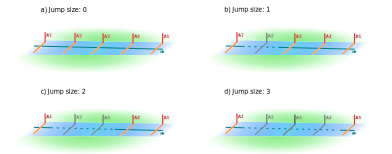

```{r setup, include = FALSE}
knitr::opts_chunk$set(
  collapse = TRUE,
  comment = "#>"
)
```

## Index

1. [Preparing your data](a-0_workspace_requirements.html)
    1. [Structuring the study area](a-1_study_area.html)
    1. [Creating a distances matrix](a-2_distances_matrix.html)
    1. [The preload() function](a-3_preload.html)
1. [explore()](b-0_explore.html)
    1. [__Processes behind explore()__](b-1_explore_processes.html)
    1. [Inspecting the explore() results](b-2_explore_results.html)
1. [migration()](c-0_migration.html)
    1. [Processes behind migration()](c-1_migration_processes.html)
    1. [Inspecting the migration() results](c-2_migration_results.html)
    1. [One-way efficiency estimations](c-3_migration_efficiency.html)
1. [residency()](d-0_residency.html)
    1. [Processes behind residency()](d-1_residency_processes.html)
    1. [Inspecting the residency() results](d-2_residency_results.html)
    1. [Multi-way efficiency estimations](d-3_residency_efficiency.html)
1. [Manual mode](e-0_manual_mode.html)
1. [Beyond the three main analyses](f-0_post_functions.html)


## Making sure everything checks out

The first thing actel does is import your data. This also includes all of your detection files, which can take a bit of time. Then, actel performs many verifications to make sure everything is all right. As the list of checks is long, I will not explore each one of them in detail here. Should something be out of the ordinary, actel will let you know with a warning or an error message, depending on the severity of the issue.

## Organising the detections

Once everything is in place, actel will start by:

1. Splitting the detections by transmitter,
2. Match the signals listed in the biometrics, 
3. Keep only the detections useful for the study. 

It is at this point that the argument [exclude.tags](b-0_explore.html#exclude.tags) comes in:

Actel uses the tag's signal to find your animal. However, if two tags with the same signal but different code spaces show up at your study area, actel will not know which one to choose. Should this happen, you must specify which tag **should be excluded** in the `exclude.tags` argument and restart the analysis. You can [find an example here.](b-0_explore.html#exclude.tags)

Once the detections are sorted and validated, actel is ready to start compiling movement events.

Note:
  : If your detections contain data from stray tags (i.e. tags that do not belong to your study), actel will ask you if you would like to save a summary of this to a "stray_tags.csv" file.

## From detections to movements

The process of compiling movement events is entirely automatic, and the outcome depends on two things:

Arrays
  : When a tag moves from one receiver array to another, a new movement event is created. These arrays are defined by you in the [spatial file](a-0_workspace_requirements.html#spatial-file), so it is worth it to spend some time thinking about how you want to arrange your receivers.

`max.interval`
  : This argument controls the creation of multiple events for consecutive detections on the same receiver array. You can [find more information about this argument here](b-0_explore.html#max.interval).

By the end of this process, you will have a list containing the movement events for each of the target tags that were detected during the study.

## Checking event quality

Upon finishing the movement event creation, actel checks the movement events to look out for strange behaviour. If something looks odd, you are given a chance to invalidate specific movement events, so that invalid detections can be discarded.

Note:
  : Rendering a movement event invalid **does not make it disappear**. However, subsequent steps in the analysis will know that the **event should not be considered** (hence the "Valid" column).

### Impassables

As you probably know by now, you can [define unidirectional connections between arrays](a-0_workspace_requirements.html#barriers). This tells actel that something (e.g. a weir or dam) prevents the animal from moving in a particular direction. Let's see the examples below, with arrays A, B and C:

 

In example 1, animals can pass from A to C and C to A freely. However, they can only pass from B to C, as the way in the opposite direction (C to B) is blocked by a weir. If a tag has a detection in C and then in B, actel will assume the animal passed through A undetected.

On the other hand, in example 2, the way from C to A is also blocked by a weir. If a tag is detected in C and afterwards either in A or B, actel will complain, as there is no viable way for the respective animal to move between both arrays.

This is the respective warning:

```
Warning: Tag R64K-1234 made an impassable jump: It is not possible to go from array C to A.
         Please resolve this either by invalidating events or by adjusting your 'spatial.txt' file and restarting.

Opening valid movement table for inspection:

[...]

Note: You can select event ranges by separating them with a ':' and/or multiple events at once by separating them with a space or a comma.
Events to be rendered invalid: 
```

As the warning says, you then have two options: Invalidate events until the impassable exception is resolved, or re-structure your spatial.txt file.


### Jumping arrays


If the tag has been jumping around (i.e. passing through multiple arrays undetected), actel will issue warnings and prompt user intervention, depending on [the values set for `jump.warning` and `jump.error`.](b-0_explore.html#jump.warning-and-jump.error)


Let's have a look at the examples below:



Assuming `jump.warning = 2` and `jump.error = 3`, examples **1** and **2** would pass through the analysis without raising any flags (**1** as a perfect situation and **2** showing an efficiency flaw in array C). 

However, in example **3**, the jump size is equal to `jump.warning`, but lower than `jump.error`. When this happens, actel will display a warning:

````
Warning: Tag R64K-1234 jumped through 2 arrays in events 1 -> 2 (A -> D).
````

Then, actel would continue the analysis. This warning is issued whenever the jump size equals or is greater than `jump.warning`. Lastly, in example **4**, the jump size is equal to the `jump.error`. When this happens, actel issues a warning like the one above, and on top of that allows the user to intervene:

````
Warning: Tag R64K-1234 jumped through 3 arrays in events 1 -> 2 (A -> E).
M: Opening movement table of tag R64K-2791 for inspection:
[...]
Would you like to render any movement event invalid?(y/N/comment)
````

From here, you can inspect the movement table and find out if some events should be removed from the analysis.


### Average speed

If you include a [distance matrix](a-0_workspace_requirements.html#optional-distances-matrix) in the analysis, you can specify the maximum expected speed for your animals using [speed.warning and speed.error](b-0_explore.html#speed.warning-and-speed.error). Doing so will trigger the speed checks, where the average speed between each movement event is compared to the specified arguments.

If the average speed is higher than `speed.warning`, a warning is triggered:

````
Warning: Tag R64K-1234 had an average speed of 1.3 m/s from valid event 3 to 4 (Array1 -> Array2).
````

If, on top of this, any of the average speeds is higher than `speed.error`, user interaction is suggested:

````
Warning: Tag R64K-1234 had an average speed of 1.3 m/s from valid event 5 to 6 (Array4 -> Array5).
M: Opening valid movements table of tag R64K-1234 for inspection:

[...]

Would you like to render any movement event invalid?(y/N/comment) 
````

From here you can then decide whether or not some movement events should be excluded.


### Inactiveness

Specifying a value for [inactive.warning and/or inactive.error](b-0_explore.html#inactive.warning-and-inactive.error) will trigger the inactiveness checks. These differ depending on whether or not you included a distance matrix in the analysis.

Inactiveness checks are performed in the tail of the movement events. That is, actel grabs the events in the last array and analyses those. Let's have a look at the example below, and assume `inactive.warning` and `inactive.error` were both set to 3 days.

|Array  | Detections|First station |Last station |First time          |Last time           |Time travelling |Time on array |
|:------|----------:|:-------------|:------------|:-------------------|:-------------------|:---------------|:-------------|
|A      |          4|St.1          |St.2         |2019-05-15 12:00:00 |2019-05-15 13:00:00 |NA              |1:00          |
|B      |          3|St.3          |St.4         |2019-05-16 13:50:00 |2019-05-16 14:40:00 |24:50           |0:50          |
|**C**  |          2|St.5          |St.6         |2019-05-17 16:00:00 |2019-05-17 16:20:00 |25:20           |0:20          |
|**C**  |          4|St.6          |St.5         |2019-05-17 17:10:00 |2019-05-17 18:00:00 |0:50            |0:50          |
|**C**  |          1|St.5          |St.5         |2019-05-20 19:45:00 |2019-05-20 19:45:00 |73:45           |0:00          |

In this case, the last three events are valid candidates for inactiveness. Actel will then check the time difference between the first detection at event 3 and the last detection at event 5. Should this difference be larger than `inactive.warning`, actel will proceed to the next step, which depends on whether the distances.matrix is present.

#### If a distances matrix is present

Actel will gather all the stations where these last detections occurred and check if they are less than 1500 metres a part. If this is true, then there is a valid case for inactivity, and a warning will be issued:

````
Warning: Tag R64K-1234 was detected 7 times at stations less than 1.5 km apart in array 'C' (St.5, St.6), over 3.07 days and then disappeared. Could it be inactive?
````

#### If a distances matrix is NOT present

Actel will count the number of individual stations in which the tag was detected. If there are three or less individual stations, there is a valid case for inactivity, and a similar warning will be issued:

````
Warning: Tag R64K-1234 was detected 7 times at three or less stations of array 'C' (St.5, St.6) over 3.07 days and then disappeared. Could it be inactive?
````

Since `inactive.error` was also set to three, this situation would trigger the possibility for user interaction:

````
M: Opening valid movement table of tag R64K-1234 for inspection. Inactiveness started on event [#] (2019-05-17):

[...]

Would you like to render any movement event invalid?(y/N/comment) 
````

From here you could then decide if some events should be removed.


#### What if the tag reached the array, moved about a bit, and only then stopped moving?

If the tag was active in array C, then it is possible that the initial detections will be in receivers located further away than 1500 metres, or in more than three unique receivers. To search for this cases, actel iterates the process above, removing one event from the top at a time, for as long as the period of residency at the array is higher than `inactive.warning`.

This means that, even if there are detections at many stations at the first events under scrutiny, potential inactiveness can still be detected at the trailing events.


### Leaving comments for later

If a tag is causing doubts, you can attach a comment to it at any time. Just reply "comment" to a question when the word "comment" shows up between brackets and the comment dialogue will be triggered:

````
Continue editing last valid events?(y/N/comment) comment
New comment on tag R64K-4456: Was this animal eaten?
M: Comment successfully stored, returning to the previous interaction.
Continue editing last valid events?(y/N/comment) 
````

You can then find all your comments in the [html report](b-2_explore_results.html#actel_explore_report.html-if-report-true)! Additionally, when you run migration() or residency(), the comments are also stored in the `status.df` object.


## Time of first detection at each array

The last thing explore() does is find out the time of first detection at each array, for each tag. This information is then used to plot [circular graphics in the report](b-2_explore_results.html#times), and is also returned within R as an output of the function.


## The explore() analysis ends here

Upon finishing the analysis, if you `report = TRUE`, the html report generated will give you an idea of what your data looks like. You may now be interested in having a more __[detailed look at the outputs of the explore().](b-2_explore_results.html)__

To advance into more detailed analyses, you can proceed either to the __[migration()](c-0_migration.html)__ analysis or to the __[residency()](d-0_residency.html)__ analysis. These will use the movement events created here to extract more complex metrics!

[Back to top.](#)

