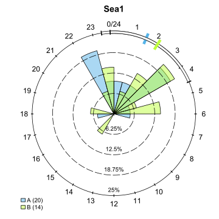

```{r setup, include = FALSE}
knitr::opts_chunk$set(
  collapse = TRUE,
  comment = "#>"
)
```

## Index

1. [Preparing your data](a-0_workspace_requirements.html)
    1. [Structuring the study area](a-1_study_area.html)
    1. [Creating a distances matrix](a-2_distances_matrix.html)
1. [explore()](b-0_explore.html)
    1. [Processes behind explore()](b-1_explore_processes.html)
    1. [__Inspecting the explore() results__](b-2_explore_results.html)
1. [migration()](c-0_migration.html)
    1. [Processes behind migration()](c-1_migration_processes.html)
    1. [Inspecting the migration() results](c-2_migration_results.html)
    1. [One-way efficiency estimations](c-3_migration_efficiency.html)
1. [residency()](d-0_residency.html)
    1. [Processes behind residency()](d-1_residency_processes.html)
    1. [Inspecting the residency() results](d-2_residency_results.html)
    1. [Multi-way efficiency estimations](d-3_residency_efficiency.html)
1. [Manual mode](e-0_manual_mode.html)
1. [Beyond the three main analyses](f-0_post_functions.html)
1. [Errors and messages](g-0_messages.html)


## Results within R

If you ran the explore function and stored it into an object (i.e. `output <- explore(...)`), this object will now be a list, containing all the useful results actel has compiled for you:

### detections

The `detections` list contains the detections found in your detections file which match your target tags, split by each of the tags. This is the base data with which actel worked. Here is an example:

|Timestamp           |Receiver |CodeSpace |Signal |Transmitter |Standard.Name |Array  |
|:-------------------|:--------|:---------|:------|:-----------|:-------------|:------|
|2018-04-18 19:07:45 |130763   |R64K      |4701   |R64K-4701   |St.2          |River1 |
|2018-04-18 19:08:06 |130763   |R64K      |4701   |R64K-4701   |St.2          |River1 |
|2018-04-18 19:56:39 |130766   |R64K      |4701   |R64K-4701   |St.7          |River1 |
|2018-04-18 20:01:11 |126324   |R64K      |4701   |R64K-4701   |St.5          |River1 |
|2018-04-18 20:13:43 |126324   |R64K      |4701   |R64K-4701   |St.5          |River1 |
|2018-04-18 20:15:11 |126324   |R64K      |4701   |R64K-4701   |St.5          |River1 |

### valid.detections

The `valid.detections` object only contains the detections that were deemed valid during the analysis.

### spatial

The `spatial` list contains the stations, release sites and some more summary information. This object may come in handy if you have to go back to your results some time after you completed the analysis, so you can verify the study area design and match the stations names to their locations.

### deployments

The `deployments` data frame is similar to t deployments.csv file, with the exception that unique serial numbers have been created for receivers which were deployed more than once.

### arrays

The `arrays` list contains detailed information for each array: Which arrays are directly before, which arrays are directly after, which arrays are valid efficiency peers, which arrays are directly OR indirectly after, and more.

### movements

The `movements` list contains the movement events created during [the detection sorting process](b-1_explore_processes.html#from-detections-to-movements). These records can become very useful if you need to go back to a given fish and inspect its behaviour in more detail. Here is an example:

|Array  | Detections|First station |Last station |First time          |Last time           |Time travelling |Time on array |
|:------|----------:|:-------------|:------------|:-------------------|:-------------------|:---------------|:-------------|
|River1 |         92|St.2          |St.2         |2018-04-18 19:07:45 |2018-04-18 23:27:29 |NA              |4:19          |
|River2 |          1|St.11         |St.11        |2018-04-18 23:49:16 |2018-04-18 23:49:16 |0:21            |-             |
|River3 |          3|St.12         |St.12        |2018-04-19 01:52:34 |2018-04-19 01:57:01 |2:03            |0:04          |
|River4 |         10|St.13         |St.13        |2018-04-19 03:35:44 |2018-04-19 03:42:17 |1:38            |0:06          |
|Bay1   |         52|St.16         |St.17        |2018-04-20 05:33:51 |2018-04-20 06:12:20 |25:51           |0:38          |
|Bay1   |         69|St.17         |St.16        |2018-04-20 12:00:31 |2018-04-20 13:00:36 |5:48            |1:00          |

### valid.movements

The `valid.movements` represents a refined version of the `movements` object, where all movements deemed invalid during the analysis were removed.

### times

The `times` data frame contains the timestamps of first valid detection in each array, for each fish. These are used to draw the circular plots in the report (like the ones below), but you can also use them to test for differences between groups!

<center>

</center>

### dist.mat

If a valid [distance matrix](a-2_distances_matrix.html) was supplied for the analysis, it will be returned together with the results. This allows you to easily check speeds between specific movements of particular interest, and can serve as a basis for other relevant metrics.


## Results in your working directory

On top of the results stored in your R session, actel saves some additional information in your working directory:

### If you said "y" during the relevant analysis questions:

#### actel_explore_results.RData

``
Would you like to save a copy of the results to actel_explore_results.RData?(y/N) 
``

To make sure that you don't accidentally lose your results, you can save them right away in the current directory. The results present in this file are the same as the ones you obtain directly in your R console (see above).

#### actel.log.txt (if report = FALSE)

```
Would you like to save a copy of the analysis log to [timestamp].actel.log.txt?(y/N)
```

This log acts as a carbon copy of the analysis. It contains everything: summary information, errors, warnings and messages and the options you have taken while the analysis was running. It is worth keeping it in case you need to find out the reasoning behind some result. To avoid overwriting when conducting multiple analysis, the actel.log.txt file is preceded by the timestamp of when it was created (e.g. '2019-05-14.10.51.40.actel.log.txt').

If you are running the analysis with report = TRUE, the log is automatically saved as part of the report.

#### stray_tags.csv

```
Stray tags were detected in your study area. Would you like to save a summary to stray_tags.csv?(y/N) 
```

Deployed receivers may pick up stray tags that came in range during the study period. This file contains a brief summary of these tags in the stray_tags.csv file, in case you are interested in knowing more about these tags, or perhaps share the codes with your colleagues.

### actel_explore_report.html (if report = TRUE)

This is the main non-R output. If you activated the `report` option, actel will compile an html report for you. For the explore function, this report contains the following sections:

1. **Summary**

  Contains brief information on the study. It is useful to check up if anything looks wrong (e.g. the number of target tags, the data range).

2. **Stations**, **Deployments** and **Releases**

  These sections contain tables listing the stations, deployments and release sites considered for the analysis. Any unknown receivers found during the analysis will also show up here. Since the station names can vary wildly, actel creates standard names for your stations (e.g. "St.1", "St.2"). When looking at the individual detection graphics, you can refer back to the spatial table to match the standard names to the respective station names.

3. **Warning messages**

  These represent warnings, errors and particularly important messages that were displayed during the analysis. By having them extracted and put together here, you can easily find out what went wrong.

4. **User comments**

  Should you type in any [comments during the analysis](b-1_explore_processes.html#leaving-comments-for-later), they will be displayed here, so you can quickly remember that lingering detail you didn't want to forget while looking at the fish's movement table.

5. **Biometrics**

  Actel crawls through you biometrics file in search for columns containing the keywords *length*, *weight* or *mass*. Should it find any matching column, it will print boxplots of the distribution of the selected variables, split by each fish group listed in the same file. This can be very helpful in quickly finding typos in the data (e.g. a displaced decimal separator).

6. **Time of arrival at each array**

  For each of your study area's arrays, a circular plot will be drawn of the first arrival time of each fish. The fish are grouped by the groups listed in the *biometrics.csv* file. These plots are saved in .svg format in the Report folder, so you can easily use them elsewhere, if needed.

7. **Graphics of detected tags**

  This section contains a plot for each of your target tags, showing all the detections found in the data for the respective fish. The detections are coloured by array. The vertical black dashed line shows the time of release. 
  
  The full dark-grey line moving between detections shows the movement events considered valid, while the dashed dark-grey line shows the movement events considered invalid. The movement event lines move straight between the first and last station of each event (i.e. in-between detections will not be individually linked by the line). 

  Note that fish where you had to manually intervene during the analysis will be highlighted with a yellow border, and fish that were manually overridden through the [`override` argument](b-0_explore.html#override) will be highlighted with a red border.

  Lastly, the total number of detections for the fish is displayed in the header, between brackets.

8. **Sensor data**

  If actel finds valid sensor data in the detections, that data will be plotted here per tag. For tags with more than one sensor, two or more panels will be drawn, one for each sensor unit.
  
9. **Actel log**

  This section contains the same information as the actel log saved in your target folder. It is useful to have a look at a few things. For example, the number of target tags, the detection data range or the number of ALS (i.e. receivers) can help you spot any missing data (i.e. if you tagged 100 fish and had only 80 target tags, some tags are missing from your input files!).


## What if actel has miss-assigned something?

Fish with strange behaviour can be complicated to analyse. While actel's functions have been designed to deal with this as best as possible, you can always [enter manual mode](e-0_manual_mode.html) if you find out that actel has miss-assigned something. I.e. has a movement event been invalidated that seems valid, or vice-versa? Are part of the movements detected characteristic of predator behaviour?


## More detailed analyses

To advance into more detailed analyses, you can proceed either to the __[migration()](c-0_migration.html)__ analysis or to the __[residency()](d-0_residency.html)__ analysis. These will use the movement events created here to extract more complex metrics!

[Back to top.](#)
