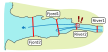
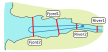
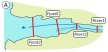

```{r setup, include = FALSE}
knitr::opts_chunk$set(
  collapse = TRUE,
  comment = "#>"
)
```

## Index

1. [Preparing your data](a-0_workspace_requirements.html)
    1. [Structuring the study area](a-1_study_area.html)
    1. [Creating a distances matrix](a-2_distances_matrix.html)
1. [explore()](b-0_explore.html)
    1. [Processes behind explore()](b-1_explore_processes.html)
    1. [Inspecting the explore() results](b-2_explore_results.html)
1. [migration()](c-0_migration.html)
    1. [__Processes behind migration()__](c-1_migration_processes.html)
    1. [Inspecting the migration() results](c-2_migration_results.html)
    1. [One-way efficiency estimations](c-3_migration_efficiency.html)
1. [residency()](d-0_residency.html)
    1. [Processes behind residency()](d-1_residency_processes.html)
    1. [Inspecting the residency() results](d-2_residency_results.html)
    1. [Multi-way efficiency estimations](d-3_residency_efficiency.html)
1. [Manual mode](e-0_manual_mode.html)
1. [Beyond the three main analyses](f-0_post_functions.html)
1. [Errors and messages](g-0_messages.html)


Note: 
  : The processes behind one-way efficiency estimations are explained in a [dedicated manual page.](c-3_migration_efficiency.html)

## Additional movement processes

The initial processes of migration() are the same as those from [the explore() function](b-1_explore_processes.html). However, when it comes to movement validity, actel will now also check if the fish was detected at an array that is not directly or indirectly below its release site. Should this happen, the following warning will be issued:

````
Warning: Fish R64K-1234 was detected in an array that is not after its release site! Opening relevant data for inspection.
   Release site: Trap
   Expected first array: River3

[...]

You may either:
  a) Stop the analysis if the expected first array is wrong;
  b) Continue as is (does not impact the results);
  c) Render a movement event invalid, if you are confident it is a false detection.

Decision:(a/b/c/comment)
````

Note:
  : An array is considered "behind the release site" if it is not part of the arrays to which the release array connects directly or indirectly. You can find the arrays considered directly or indirectly after/below of each array by checking the [arrays object](b-2_explore_results.html#arrays).

## Section movements

Upon validating the movement events, the migration analysis proceeds to compressing these array-level events into section-level events. These section-level events are then used to access the unidirectionality of movement, from release to the success arrays.

### Backwards movements

Tagged fish can move backwards either because they are reluctant of the new environments or because something ate them and you are now tracking the predator. The very first evidence of this is that the arrays to which each movement event belongs will no longer be arranged as expected. 

If this happens, but then the fish continues its journey, then the last movement events on each section will still be ordered as expected. Otherwise, if the fish moves backwards and then never returns, then the last movement events of each section will also be in an unexpected order. 

Let's have a look at two examples:

 

#### A) Movement events unordered, but last events ordered

In this example, the fish starts by moving towards the Fjord, as expected, but then the moves back upstream into the river again. However, the fish then moves back in the expected direction and eventually leaves the study area. In this case, the last event in the Fjord will be after the last event in the River.

These backwards movements imply going to an anterior section, which has an impact in the definition of entry and exit times. As such, a warning will be issued:

````
Warning: Inter-section backwards movements were detected for Fish R64K-4456.
````

#### B) Both Movement events and last events are unordered

In this example, contrary to the above, the fish moves back into the river and then disappears. This means that the last event in the Fjord is actually **before** the last event in the River. 

This has both an impact on the assignment of section entry and exit times and also on the assignment of the fish's fate. As such, a warning will be issued:

````
Warning: Inter-section backwards movements were detected for Fish R64K-4526 and the last events are not ordered!
````

#### Making movements linear

 

If a fish has moved back and forth between sections, actel will open the section movements and provide you with a suggestion to linearise the movements:

````
Warning: Inter-section backwards movements were detected for fish R64K-4508.
To linearise the movements, actel suggests invalidating the following events: ...
Opening movements list for inspection:

[...]

Note: You can select event ranges by separating them with a ':' and/or multiple events at once by separating them with a space or a comma.
Events to be rendered invalid: 
````

By default, actel will suggest removing all the backwards movement events. This is graphically shown in the two panels above, where the dashed movement events would not be considered. However, for any number of reasons, you may find that that is not the best solution, and as such you can manually decide which events to invalidate. There is no universal answer to this, you must analyse your scenario and decide the best course of action.


Once all fish have been validated, if any section movement has been deemed invalid, the respective array movements will also be invalidated. Actel will let you know this happened by issuing a message:

````
M: Rendering 1 array movement(s) invalid for fish R64K-4508 as the respective section movements were discarded by the user.
````

<span style="color:red">Note:</span>
  : If your many of your fish are performing migrations __within__ the study area, you should consider using the [residency() function](d-0_residency.html) instead.
  : Even though the dashed events are discarded from the time analyses, the number of backwards movements displayed by each fish will still be recorded in the [`status.df` object](c-2_migration_results.html#status.df).


## Compiling a timetable

Once the movement events have been defined, they will be used to fill in the timetable, which is the most important step of migration(). For each fish, actel will find out the first and last valid movement event for each of the [study area's sections](a-1_study_area.html#sections). Once actel determines when the fish entered and left the study area's sections, it becomes possible to determine the fish's fate.


## Combining the time data with the biometrics

Finally, actel will automatically combine the time information with the information you included in the biometrics file. This new data frame is called *status.df*, and will be available to you in the function output. It is also here that the [`success.arrays` variable](c-0_migration.html#success.arrays) comes in. If your fish was last detected on an one of those arrays, it's fate will be assigned as "Succeeded".


## Inspecting the results

Finally, actel will compile some summary tables, prepare the report, and finish up. 

__[Learn more about the results of migration()](c-2_migration_results.html)__


[Back to top.](#)