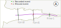
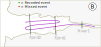
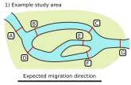
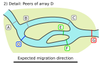
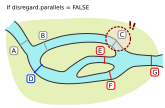

```{r setup, include = FALSE}
knitr::opts_chunk$set(
  collapse = TRUE,
  comment = "#>"
)
```

## Index

1. [Preparing your data](a-0_workspace_requirements.html)
    1. [Structuring the study area](a-1_study_area.html)
    1. [Creating a distances matrix](a-2_distances_matrix.html)
    1. [The preload() function](a-3_preload.html)
1. [explore()](b-0_explore.html)
    1. [Processes behind explore()](b-1_explore_processes.html)
    1. [Inspecting the explore() results](b-2_explore_results.html)
1. [migration()](c-0_migration.html)
    1. [Processes behind migration()](c-1_migration_processes.html)
    1. [Inspecting the migration() results](c-2_migration_results.html)
    1. [__One-way efficiency estimations__](c-3_migration_efficiency.html)
1. [residency()](d-0_residency.html)
    1. [Processes behind residency()](d-1_residency_processes.html)
    1. [Inspecting the residency() results](d-2_residency_results.html)
    1. [Multi-way efficiency estimations](d-3_residency_efficiency.html)
1. [Manual mode](e-0_manual_mode.html)
1. [Beyond the three main analyses](f-0_post_functions.html)


## Forward efficiency

During the migration analysis, actel calculates forward efficiency only, to improve the accuracy of the efficiency measurement. This means that, for each tag, only the first forward movement is considered. Let's have a look at these examples:

 

In example **A**, the tag moved out to the sea, and was detected at the array River1 and Fjord2, but not at Fjord1. This is considered a missed event for Fjord1. Even if the tag then moved backwards and ended up being detected at Fjord1 at a later time (example **B**), since the first expected detection was missed, this tag will still be considered as missed by Fjord1, as far as efficiency calculations are concerned.

These efficiency calculations are dependant on the way you organise your receivers, so it is important that you [organise your study area in an actel-friendly way.](a-1_study_area.html)


## CJS and multiple branches

Actel calculates array efficiency through CJS modelling, based in the equations provided by <a href="https://www.researchgate.net/publication/256443823_Using_mark-recapture_models_to_estimate_survival_from_telemetry_data" target="_blank">Perry et al. (2012)</a>. In short, this implies comparing the individual tags detected at an array with those detected at the arrays that come after that said array.

One of the caveats of the CJS calculations is that if, say, we have arrays A and B, and B is after A, then a tag that is detected at B must have passed through A as well. However, this may not be the case if there are multiple water channels that the animal can go through.

To compensate for this, actel finds valid efficiency peers for each array. That is, arrays that are directly or indirectly after a given array, and to which it is not possible to get to without passing through said array (assuming the tag does not move backwards). Then, actel combines the unique tags detected at all of the efficiency peers of a given array, and uses these combined detections as a single array subsequent to the one being analysed. The individual CJS models are then combined to create the [`overall.CJS` object](c-2_migration_results.html#overall.cjs).


## Dealing with parallel arrays

Parallel arrays are particularly tricky to deal with, because they do not come before, nor after their neighbours.
It is here that [the argument `disregard.parallels`](c-0_migration.html#disregard.parallels) comes in. Let's have a look at this study area, which has up to three branches.

<center>
 
</center>

With this spatial.txt:

```
A -- B -- C -- G
A -- D -- E -- G
D -- F -- G
D -- B -- D
C -- E -- C
C -- F -- C
E -- F -- E
```

It is particularly relevant to note that :

  - __D__ and __B__ are parallel, and so are __C__, __E__ and __F__.

Now let's try to determine the valid efficiency peers of array __D__, first with `disregard.parallels = TRUE` and then with `disregard.parallels = FALSE`.


### if disregard.parallels = TRUE

<center>

</center>

Array __D__ has three arrays directly or indirectly after it: __E__, __F__ and __G__. When `disregard.parallels = TRUE`, actel will ask the following question, for each of the arrays coming after __D__:

    Can an animal get to array [x] without having to pass through array D?

This assumes that the animal is expected to move only in one direction (i.e. from release to a success array). If the answer to this question is no, then array [x] is a valid efficiency peer of array __D__. Both arrays __E__ and __F__ fulfil this requirement, as the only array coming before them is __D__ itself. However, array __G__ fails this requirement, because the animals can get to array __G__ coming from array __C__, which is not connected to array __D__.

So, if `disregard.parallels = TRUE`, arrays __E__ and __F__ are valid efficiency peers of array __D__.


### if disregard.parallels = FALSE

<center>

</center>

In this case, since `disregard.parallels = FALSE`, actel asks an additional question:

    1) Can an animal get to array [x] without having to pass through array D?
    2) Does array [x] have any parallel arrays which can be reached without passing through array D?

Again, if the answer to both of these questions is no, then array [x] is a valid efficiency peer for array __D__. As we saw above, arrays __E__ and __F__ fulfil the first requirement. However, both of these arrays have an extra parallel array (array __C__), and it is possible to reach that array without passing through array __D__. 

As such, if `disregard.parallels = FALSE`, then array __D__ no longer has any valid peers.


### So, should you go with TRUE or FALSE?

It depends on your study area, and on your animals. If you expect that the tagged animals are likely to move between parallel arrays (e.g. because these arrays are very close to each other), then it may be a good idea to __not__ disregard the presence of parallels (i.e. run the analysis with `disregard.parallels = FALSE`). A practical example would be if you have multiple channels leading to a lake, and you have arrays at each lake entrance. As the animals may have to explore other lake entrances before finding the lake exit, disregarding parallel arrays could potentially lead to underestimations of array efficiency.

Keep in mind that you can always run the analysis twice, and find out which case fits best your data!


## Arrays with no efficiency peers

Regardless of the mechanics explained above, arrays __C__, __E__, __F__ and __G__ would never have any valid efficiency peers. As such, inter-array efficiency cannot be calculated for them using a CJS model. However, you have the chance to calculate intra-array efficiency, if an array is [composed by two lines of receivers](c-0_migration.html#replicates). You can find the efficiency peers of each array in the [`arrays` object](b-2_explore_results.html#arrays).


#### Intra-array efficiency

Intra array efficiency calculations are also performed following the equations provided by <a href="https://www.researchgate.net/publication/256443823_Using_mark-recapture_models_to_estimate_survival_from_telemetry_data" target="_blank">Perry et al. (2012)</a>. Specifically, actel splits the array's receivers in "original" and "replicates" (depending on what you specified in the [replicates argument](c-0_migration.html#replicates)), and compares the tags detected at both of these elements. The results of the intra-array calculations for each array are then stored in the [`intra.array.CJS` list](c-2_migration_results.html#intra.array.cjs).

**<a href="javascript:history.back()">Return to previous page</a>**

[Back to top.](#)
