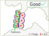
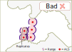
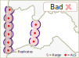
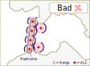

```{r setup, include = FALSE}
knitr::opts_chunk$set(
  collapse = TRUE,
  comment = "#>"
)
```

## Index

1. [Preparing your data](a-0_workspace_requirements.html)
    1. [Structuring the study area](a-1_study_area.html)
    1. [Creating a distances matrix](a-2_distances_matrix.html)
    1. [The preload() function](a-3_preload.html)
1. [explore()](b-0_explore.html)
    1. [Processes behind explore()](b-1_explore_processes.html)
    1. [Inspecting the explore() results](b-2_explore_results.html)
1. [migration()](c-0_migration.html)
    1. [Processes behind migration()](c-1_migration_processes.html)
    1. [Inspecting the migration() results](c-2_migration_results.html)
    1. [One-way efficiency estimations](c-3_migration_efficiency.html)
1. [__residency()__](d-0_residency.html)
    1. [Processes behind residency()](d-1_residency_processes.html)
    1. [Inspecting the residency() results](d-2_residency_results.html)
    1. [Multi-way efficiency estimations](d-3_residency_efficiency.html)
1. [Manual mode](e-0_manual_mode.html)
1. [Beyond the three main analyses](f-0_post_functions.html)

## The residency() function

The residency() function builds on the same principles as the explore function and, in addition, computes metrics aiming to show the fish behaviour over time.

residency() has the same arguments as explore(), and includes a set of new arguments aimed to control the residency-related metrics. Like with explore, you *do not need to start working with all arguments right away.* Defining the `tz` is enough to get you going!

```r
residency(tz = "Europe/Copenhagen")
```

## Residency arguments

The arguments within residency() allow you thoroughly analyse the fish behaviour.

```r
residency(tz, section.order = NULL, success.arrays = NULL, max.interval = 60, minimum.detections = 2, 
  start.time = NULL, stop.time = NULL, speed.method = c("last to first", "first to first"), 
  speed.warning = NULL, speed.error = NULL, jump.warning = 2, jump.error = 3, inactive.warning = NULL,
  inactive.error = NULL, exclude.tags = NULL, override = NULL, report = FALSE, auto.open = TRUE,
  discard.orphans = FALSE, save.detections = FALSE, section.minimum = 2, timestep = c("days", "hours"),
  replicates = NULL, GUI = c("needed", "always", "never"), plot.detections.by = c("stations", "arrays"))
```

Below are listed the new arguments, which do not exist in explore. If you cannot find a description of an argument here, [have a look at the explore() page](b-0_explore.html#general-arguments).

### section.order

This argument allows you to specify by which order you would like the sections to appear in plots and tables. By default, actel will order the sections by the order in which they appear in the spatial.csv file. However, you can force a specific order using the `section.order` argument. To learn more about how to organise your study area in an actel-friendly way, have a look at [this manual page.](a-1_study_area.html)

### section.minimum

This argument controls how many times a fish must be registered at a section for the event to be considered reliable. As part of the analysis, residency() will crunch the array level movement events into section level events. Should there be section events with less overall detections than those listed in `section.minimum`, a warning is raised, and you are given the chance to render events invalid.

You can find more about the [creation and validation of section movements here](d-1_residency_processes.html#section-movements).

## timestep

By default, residency metrics are calculated on a daily basis (e.g. where did my fish spent the most time this day?). However, you may be interested in extracting results at a finer scale. By setting `timestep = "hours"`, actel will calculate all residency-related values on an hourly basis, rather than on a daily basis.

Note:
  : Setting `timestep` to hours will increase computing times.

### replicates

Estimating inter-array efficiency can be tricky in study areas with multiple channels and pathways. However, if these "isolated" arrays are composed by two lines of receivers, one line can be used as a replicate of the other, which in turn allows for the estimation of intra-array efficiency. If this is your case, then you should make use of the `replicates` argument.

Note:
  : Array replication should only be performed if the replicate stations cover the same extent of the migration route section as the opposite stations, and only if the two lines of receivers are close to each other (i.e. one can assume 0% mortality between them). Have a look at the figures below for some examples.

 

 


#### Setting up the replicates argument

You **must use the stations standard names** (i.e. St.10, St.12) when referring to replicates. If you are not sure what the standard names of your stations are, you can run `loadSpatial()` in the same folder as your spatial.csv file or `loadSpatial(file = "path/to/spatial.csv")` to check them out (look at the last column).

Once you know which replicates you want to list for your array(s), you can include them in the analysis. Lets imagine you want to use stations St.1 and St.2 as replicates for the array River1, and St.3 as a replicate for array River3. This is how they should be listed:

```r
residency([...], estimates = list(River1 = c("St.1", "St.2"), River3 = "St.3"))
```
Where [...] stands for other arguments you want to specify in the function.

It is important that you list replicates using the `list(Array = "Replicate")` construction. Keep this in mind while you prepare the code.

Now that you know how to run the residency analysis, you may want to:

__[Learn more about what residency() is doing](d-1_residency_processes.html)__

__[Learn more about the results of residency()](d-2_residency_results.html)__

[Back to top.](#)
