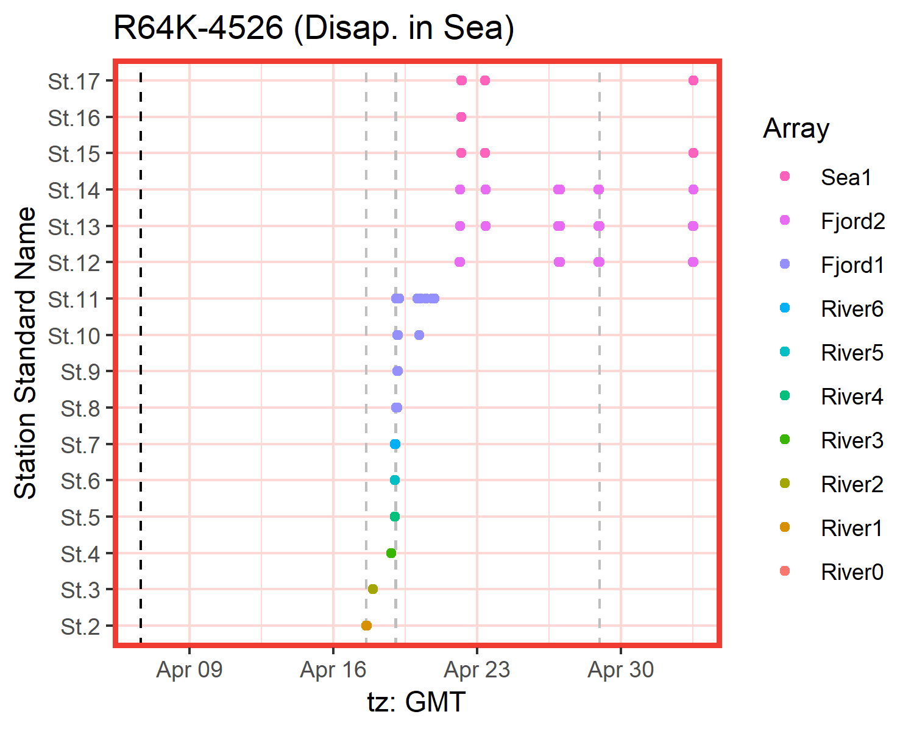

```{r setup, include = FALSE}
knitr::opts_chunk$set(
  collapse = TRUE,
  comment = "#>"
)
```

## Index

1. [Preparing your data](a-0_workspace_requirements.html)
    1. [Structuring the study area](a-1_study_area.html)
    1. [Creating a distances matrix](a-2_distances_matrix.html)
1. [explore()](b-0_explore.html)
    1. [Processes behind explore()](b-1_explore_processes.html)
    1. [Inspecting the explore() results](b-2_explore_results.html)
1. [migration()](c-0_migration.html)
    1. [Processes behind migration()](c-1_migration_processes.html)
    1. [Inspecting the migration() results](c-2_migration_results.html)
    1. [One-way efficiency estimations](c-3_migration_efficiency.html)
1. [residency()](d-0_residency.html)
    1. [Processes behind residency()](d-1_residency_processes.html)
    1. [Inspecting the residency() results](d-2_residency_results.html)
    1. [Multi-way efficiency estimations](d-3_residency_efficiency.html)
1. [__Manual mode__](e-0_manual_mode.html)
1. [Beyond the three main analyses](f-0_post_functions.html)
1. [Errors and messages](g-0_messages.html)

## Refining the results

As you inspect your results, you may find out that you would rather change a specific outcome. For example, perhaps a detection was discarded that is actually relevant, or there are detections that clearly match a predator's behaviour rather than your fish and actel didn't pick that up.

When this happens, it is time to take the lead and tell actel what you want to do, by triggering the manual processing mode. To do this, simply add the transmitters that you want to deal with manually in the `override` argument (e.g. `override = c("R64K-1234", "R64K-1405")`).

When you list tags in `override`, actel will bypass all of the normal checks and give you full control over movement validity. You will know this is happening when you see the following message:

```
----------------------------
M: Override has been triggered for fish R64K-1234. Entering full manual mode.
Opening movements list for inspection.

[...]

Would you like to render any movement event invalid?(y/N/comment) 
```

You must then decide whether or not you want to invalidate any events and which events you would like to be invalidated. Once you have finished your edits, actel will automatically terminate manual mode and proceed with the analysis.

## actel report with overridden fish

When you trigger the manual mode, actel will flag that in the report's summary. On top of that, the graphics for fish that have been manually overridden will be highlighted in red, so you can quickly find them. Below you can see the difference between the original graphic (on the left) and the manually overridden version (on the right):

 

[Back to top.](#)
